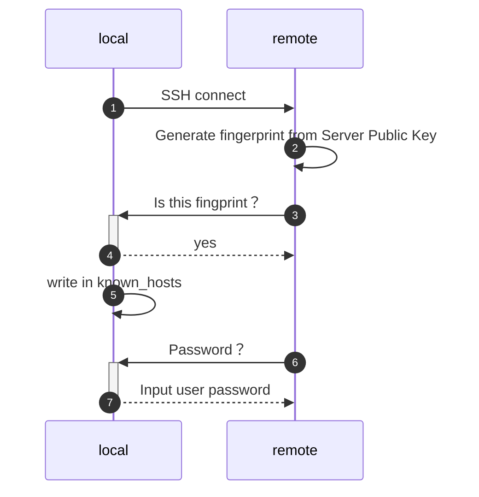

## 1. 原理



## 2. 实验

我们通过 VMWare/VirtualBox等 虚拟机管理软件安装好Ubuntu桌面版之后，进到桌面里并打开 terminal，首先

### 2.1 确认 Fingerprint 添加的位置

```shell
# 追加 fingerprint 前
$ cat ~/.ssh/known_hosts

# 该fingerprint是由ECDSA key通过SHA256生成的
# f2TduTCqvnPtV0X4NjJuGWTCTvv1zrZ6o02pR7l91PE
$ ssh  xiaojie@ubuntu 
The authenticity of host 'ubuntu (127.0.1.1)' can't be established.
ECDSA key fingerprint is SHA256:f2TduTCqvnPtV0X4NjJuGWTCTvv1zrZ6o02pR7l91PE.
Are you sure you want to continue connecting (yes/no)? yes
Warning: Permanently added 'ubuntu' (ECDSA) to the list of known hosts.

# 追加 fingerprint 后
$ cat ~/.ssh/known_hosts
|1|xnqLsAJTszF/5veaA08X0z0yoFk=|9diGH8pqVfh1bIwQpJudFvm3mYc= ecdsa-sha2-nistp256 AAAAE2VjZHNhLXNoYTItbmlzdHAyNTYAAAAIbmlzdHAyNTYAAABBBN3zTtyrfWzSMnpCwh8NuOM3PABAnd1qZAN5HORNZraEAcz1oBPDAv+mFMPS43H9k51EMVCvg+tfV/smH7KCs34=
```


### 2.2 如何确认Fingerprint

在 `/etc/ssh/` 可以发现 <u>SSH服务器</u> 所使用的<u>非对称密钥(host key)</u>：

```shell
###
# 登录服务器
###

# 我们发现了ECDSA key 
# - ssh_host_ecdsa_key		 =>private key
# - ssh_host_ecdsa_key.pub 	 =>public key
$ ls /etc/ssh/ -l
total 580
-rw-r--r-- 1 root root 553122 Mar  4  2019 moduli
-rw-r--r-- 1 root root   1580 Mar  4  2019 ssh_config
-rw-r--r-- 1 root root   3264 Mar  4  2019 sshd_config
-rw------- 1 root root    227 Feb 27  2020 ssh_host_ecdsa_key
-rw-r--r-- 1 root root    173 Feb 27  2020 ssh_host_ecdsa_key.pub
-rw------- 1 root root    399 Feb 27  2020 ssh_host_ed25519_key
-rw-r--r-- 1 root root     93 Feb 27  2020 ssh_host_ed25519_key.pub
-rw------- 1 root root   1679 Feb 27  2020 ssh_host_rsa_key
-rw-r--r-- 1 root root    393 Feb 27  2020 ssh_host_rsa_key.pub
-rw-r--r-- 1 root root    338 Feb 27  2020 ssh_import_id

# 服务器的公钥
$ cat /etc/ssh/ssh_host_ecdsa_key.pub 
ecdsa-sha2-nistp256 AAAAE2VjZHNhLXNoYTItbmlzdHAyNTYAAAAIbmlzdHAyNTYAAABBBN3zTtyrfWzSMnpCwh8NuOM3PABAnd1qZAN5HORNZraEAcz1oBPDAv+mFMPS43H9k51EMVCvg+tfV/smH7KCs34= root@ubuntu
```

```bash
###
# 登录客户端
###
# 查看服务器端的公钥
$ cat ~/.ssh/known_hosts
|1|xnqLsAJTszF/5veaA08X0z0yoFk=|9diGH8pqVfh1bIwQpJudFvm3mYc= ecdsa-sha2-nistp256 AAAAE2VjZHNhLXNoYTItbmlzdHAyNTYAAAAIbmlzdHAyNTYAAABBBN3zTtyrfWzSMnpCwh8NuOM3PABAnd1qZAN5HORNZraEAcz1oBPDAv+mFMPS43H9k51EMVCvg+tfV/smH7KCs34=
```

通过 Notepad++ 的对比工具，我们可以看到差异。


1. `|1|xnqLsAJTszF/5veaA08X0z0yoFk=|9diGH8pqVfh1bIwQpJudFvm3mYc=`  （`known_hosts`专有）
2. 算法 + public key （`known_hosts` 和 `ssh_host_ecdsa_key.pub` 均有）
3. `root@ubuntu`（ `ssh_host_ecdsa_key.pub` 专有）

②和③不进行扩展探讨。① 是 IP address。因为 Ubuntu 默认开启了 `HashKnownHosts=yes`，所以此 IP address 被 hash 了。详情参考 [man手册](https://man7.org/linux/man-pages/man5/ssh_config.5.html)。


### 实验1 - 获得Fingerprint

Fingerprint <sup>指纹</sup>，当<u>第一次</u>连接 <u>SSH服务端</u> 的时候，SSH客户端 将会把 <u>服务端的 public key 的 Fingerprint</u> 展示给用户看，以作校验。当回答 Yes之后，就认为确认该服务器是可靠的。

Fingerprint 生成命令<sup>[[来源]](http://man.openbsd.org/ssh.1#VERIFYING_HOST_KEYS)</sup>：

```bash
# ECDSA key fingerprint is SHA256:f2TduTCqvnPtV0X4NjJuGWTCTvv1zrZ6o02pR7l91PE. <-对照
$ ssh-keygen -l -f /etc/ssh/ssh_host_ecdsa_key.pub
256 SHA256:f2TduTCqvnPtV0X4NjJuGWTCTvv1zrZ6o02pR7l91PE root@xiaojie-ubuntu (ECDSA)
```


### 实验2 - 在 known_hosts 里添加真实的IP地址，而不是哈希过的IP地址

有趣的是，我们输入真实的IP地址，也可以使 `known_hosts` 生效：

```shell
$ ssh xiaojie@ubuntu
The authenticity of host 'ubuntu (127.0.1.1)' can't be established.
ECDSA key fingerprint is SHA256:f2TduTCqvnPtV0X4NjJuGWTCTvv1zrZ6o02pR7l91PE.
Are you sure you want to continue connecting (yes/no)? ^C

$ key_part=($(cat /etc/ssh/ssh_host_ecdsa_key.pub | tr ' ' '\n' ))
$ algorithm="${key_part[1]}"
$ public_key=${key_part[2]}
$ echo "ubuntu ${algorithm} ${public_key}" | tee -a ~/.ssh/known_hosts  

# skip the hint
$ ssh xiaojie@ubuntu
xiaojie@ubuntu's password: 
```

### 实验3 - 通过命令行生成 known_hosts 记录

```bash
# 初始化
key_part=($(cat /etc/ssh/ssh_host_ecdsa_key.pub | tr ' ' '\n' ))
algorithm="${key_part[0]}"
public_key="${key_part[1]}"

# ssh-keygen
# -f	filename Specifies the filename of the key file.This replaces all hostnames and addresses with hashed representations within the specified file
# -H	Hash a known_hosts file. 

# 第一次
$ echo "localhost ${algorithm} ${public_key}" | tee ~/.ssh/known_hosts  
$ ssh xiaojie@localhost # 确认能跳过 Fingerprint 校验
xiaojie@localhost's password:

# 进行Hash
$ ssh-keygen -f  ~/.ssh/known_hosts  -H 
/home/xiaojie/.ssh/known_hosts updated.
Original contents retained as /home/xiaojie/.ssh/known_hosts.old
WARNING: /home/xiaojie/.ssh/known_hosts.old contains unhashed entries
Delete this file to ensure privacy of hostnames

# 结果1
$ cat  ~/.ssh/known_hosts
|1|RW0IgbTBnuy62byYN2g+68INw6w=|xL+W7STYwPk020DE0MqSQlR61I8= ecdsa-sha2-nistp256 AAAAE2VjZHNhLXNoYTItbmlzdHAyNTYAAAAIbmlzdHAyNTYAAABBBI64qGNCHDlklX+GOOixGRR0KP49gYES/oOfDHUaKhLYLJhlniv4HkH4Ewx4PeBcpQPxoEwh0F+YXAalUxX64t4=

# 第二次
# 获得Hash后的known_hosts
$ rm ~/.ssh/known_hosts
$ ssh xiaojie@localhost
The authenticity of host 'localhost (127.0.0.1)' can't be established.
ECDSA key fingerprint is SHA256:Km47D/u1Lb144IFniS8hltHc2foT8UZQ7Y2+wFfxc/s.
Are you sure you want to continue connecting (yes/no/[fingerprint])? yes
Warning: Permanently added 'localhost' (ECDSA) to the list of known hosts.
xiaojie@localhost's password: 

# 结果2
$ cat ~/.ssh/known_hosts
|1|/uWWXcAD7S/MpBF0SOk8UQ2waAM=|+TgcDy9/az+iufvGuURb2SAqeOs= ecdsa-sha2-nistp256 AAAAE2VjZHNhLXNoYTItbmlzdHAyNTYAAAAIbmlzdHAyNTYAAABBBI64qGNCHDlklX+GOOixGRR0KP49gYES/oOfDHUaKhLYLJhlniv4HkH4Ewx4PeBcpQPxoEwh0F+YXAalUxX64t4=
xiaojie@xiaojie-ubuntu:~$ 

# 第三次
$ echo "127.0.0.1 ${algorithm} ${public_key}" | tee ~/.ssh/known_hosts  
$ ssh-keygen -f  ~/.ssh/known_hosts  -H
...
$ cat  ~/.ssh/known_hosts
|1|TZjrhag93izYTGXmxrpw7DP9W6E=|LdPrgVOLZNrhzm3SwCFb4Uk0uuI= ecdsa-sha2-nistp256 AAAAE2VjZHNhLXNoYTItbmlzdHAyNTYAAAAIbmlzdHAyNTYAAABBBI64qGNCHDlklX+GOOixGRR0KP49gYES/oOfDHUaKhLYLJhlniv4HkH4Ewx4PeBcpQPxoEwh0F+YXAalUxX64t4=
$ ssh xiaojie@localhost
The authenticity of host 'localhost (127.0.0.1)' can't be established.
ECDSA key fingerprint is SHA256:Km47D/u1Lb144IFniS8hltHc2foT8UZQ7Y2+wFfxc/s.
Are you sure you want to continue connecting (yes/no/[fingerprint])? ^C
```

结合 实验2 和 实验3，可以发现，其实 `~/.ssh/known_hosts` 存在细节内容需要去考察—— **ssh-keygen 获得的内容与 SSH 自动记录的内容不完全一致，区别在于 host 部分。**


