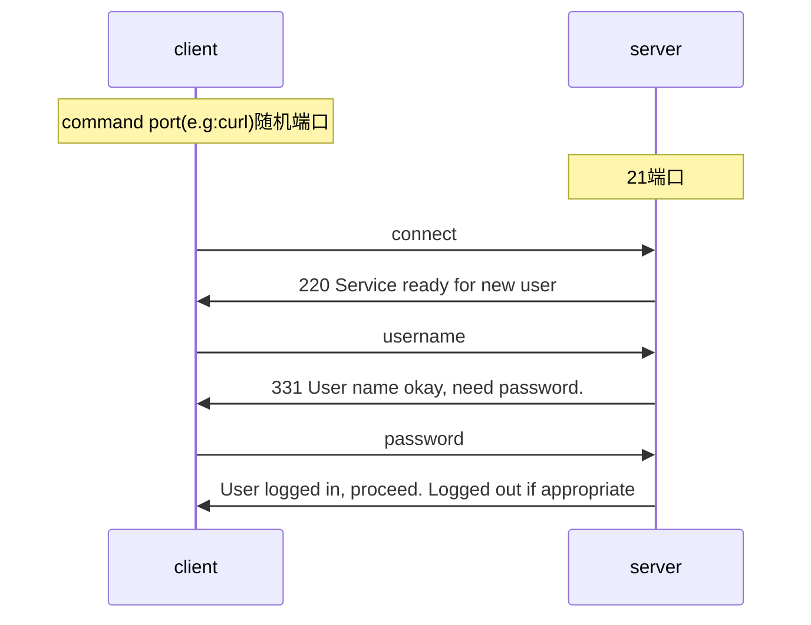
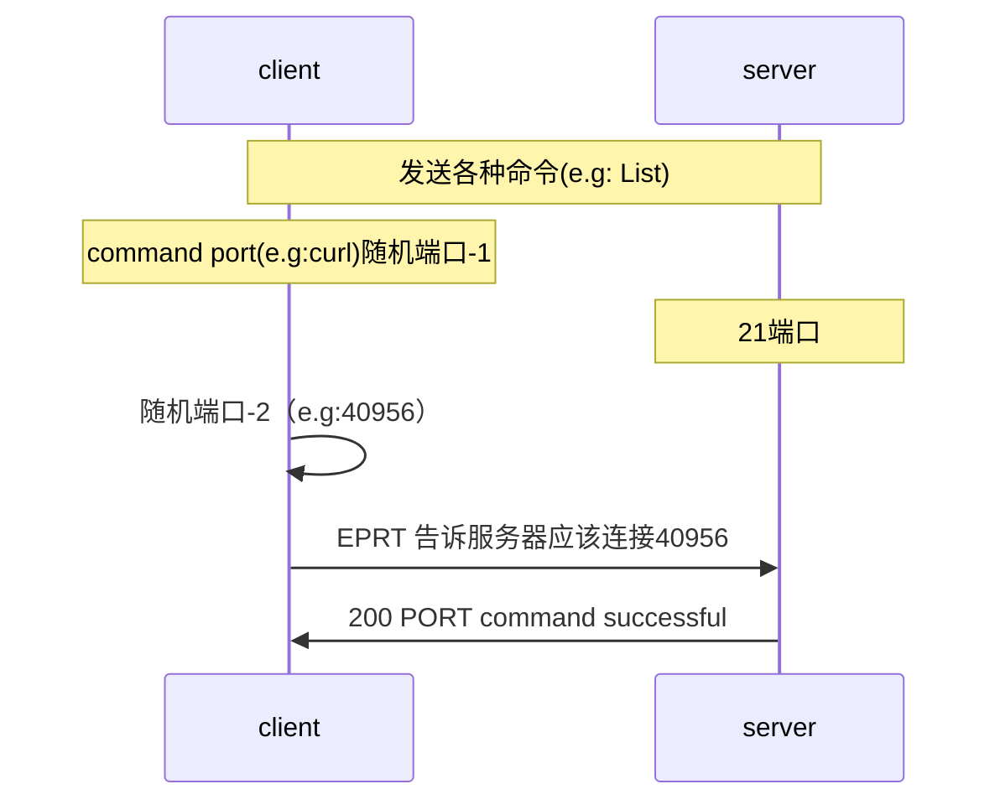
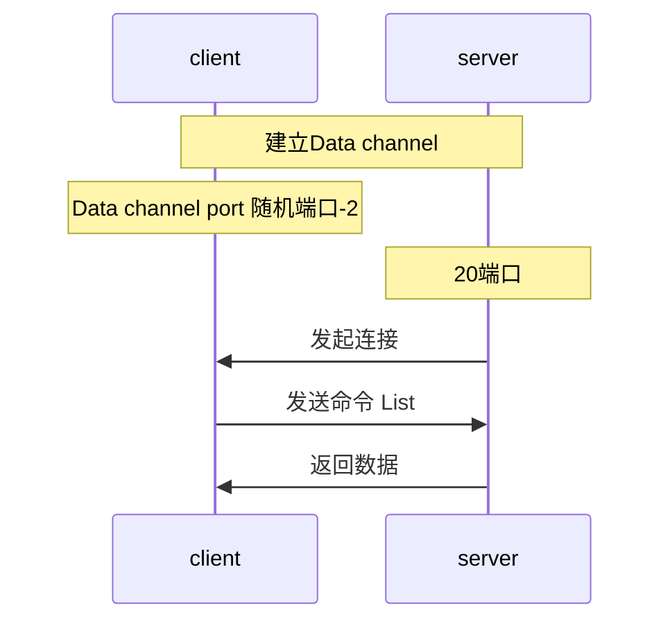
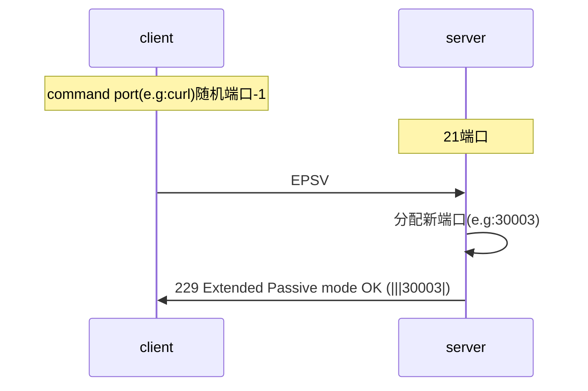
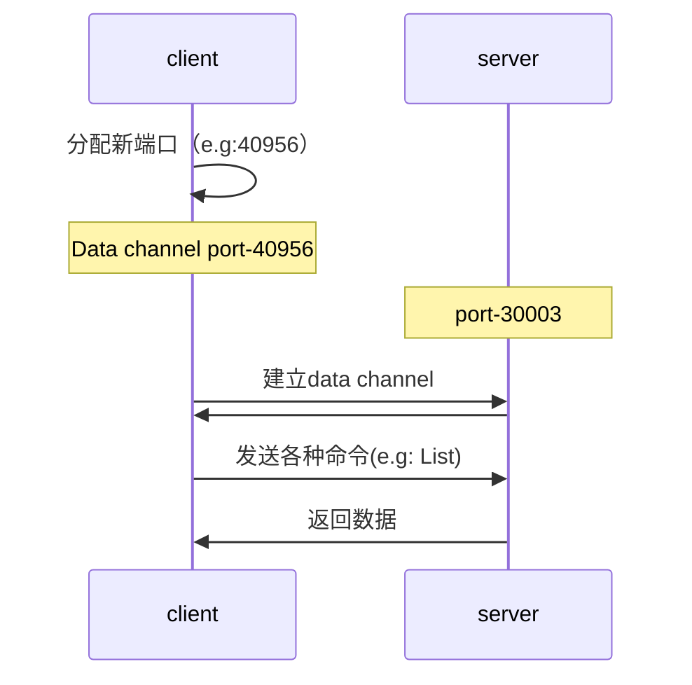

FTP<sup> File Transfer Protocol</sup>，是用于网络传输文件的协议。

## 过程 Progress 

FTP有 Active Mode（主动模式） 和 Passive Mode（被动模式）两个模式，区别在于 *建立数据连接* 的过程 。以下是 FTP 建立连接的过程：

1. 用户验证

2. 建立连接
   - 主动模式
   - 被动模式

3. 建立连接后

### 用户认证 User Authentication

建立普通的连接，并对客户端传来的用户和密码 进行 *用户认证*。



```shell
*   Trying 127.0.0.1...
* TCP_NODELAY set
* Connected to localhost (127.0.0.1) port 21 (#0)
< 220---------- Welcome to Pure-FTPd [privsep] [TLS] ----------
< 220-You are user number 1 of 5 allowed.
< 220-Local time is now 11:52. Server port: 21.
< 220-This is a private system - No anonymous login
< 220-IPv6 connections are also welcome on this server.
< 220 You will be disconnected after 15 minutes of inactivity.
# 明文（clear text）发送用户名
> USER username
< 331 User username OK. Password required
# 明文（clear text）发送密码
> PASS mypass
< 230 OK. Current directory is /
```

注：

- Return Code（返回码）的代码的意义可 参考 [wiki](https://en.wikipedia.org/wiki/List_of_FTP_server_return_codes)。

### 建立数据连接 Establishing A Data Connection

FTP的数据传输是使用 *Data Channel*。Active Mode 下，Data Channel 是由服务器建立的；而在 Passive  Mode 下，Data Channel 是由客户端建立的。一般而言，**客户端**的防火墙**不允许**任何外部机器*向服务器*发起连接，但是**允许**服务器*向客户端*发起连接，所以大家常常使用 Passive Mode。<sup>[[参考]](https://stackoverflow.com/questions/1699145/what-is-the-difference-between-active-and-passive-ftp)</sup> 

#### Active Mode

告知服务器使用新的端口：



建立 Data channel



```bash
# 告知服务器使用新的端口
> EPRT |1|127.0.0.1|40956|
* ftp_perform ends with SECONDARY: 1
# 建立 Data channel
< 200 PORT command successful
* Connect data stream actively
# 发送命令
> LIST
< 150 Connecting to port 51801
* Maxdownload = -1
* Preparing for accepting server on data port
* Checking for server connect
* Ready to accept data connection from server
* Connection accepted from server
-rw-r--r--    1 1000       ftpgroup            0 Oct  3 11:00 aaa
-rw-r--r--    1 1000       ftpgroup            0 Oct  3 09:46 test.txt
* Remembering we are in dir ""
< 226-Options: -l 
< 226 2 matches total
* Connection #0 to host localhost left intact
```

#### Passive  Mode

服务器告知客户端端口：






```bash
# 服务器告知客户端端口
> EPSV
* Connect data stream passively
* ftp_perform ends with SECONDARY: 0
< 229 Extended Passive mode OK (|||30003|)

# 客户端主动去连接
*   Trying 127.0.0.1...
* TCP_NODELAY set
* Connecting to 127.0.0.1 (127.0.0.1) port 30003
* Connected to localhost (127.0.0.1) port 21 (#0)
> TYPE A
< 200 TYPE is now ASCII

# 发送命令
> LIST
< 150 Accepted data connection
* Maxdownload = -1
-rw-r--r--    1 1000       ftpgroup            0 Oct  3 11:00 aaa
-rw-r--r--    1 1000       ftpgroup            0 Oct  3 09:46 test.txt
* Remembering we are in dir ""
< 226-Options: -l 
< 226 2 matches total
* Connection #0 to host localhost left intact

```

### connect之后的curl内容

```bash
# 查看目录
> LIST
< 150 Accepted data connection
* Maxdownload = -1
-rw-r--r--    1 1000       ftpgroup            0 Oct  3 11:00 aaa
-rw-r--r--    1 1000       ftpgroup            0 Oct  3 09:46 test.txt
* Remembering we are in dir ""
```

## Security

FTP 可通过以下命令进行登录。

```shell
$ curl -u ${用户名}:${密码} ftp://${地址}/${目录}
```

而 `curl`  当没有指定任何 authentication method 时，默认使用 basic authentication。<sup>[[curl]](https://curl.haxx.se/docs/manpage.html#--basic)</sup> 总所周知，basic authentication 是明文发送用户和密码，所以公开环境不安全。通过 `-v` 可以查看到发送的用户和密码，详情参考 [实验](#curl下操作) 章节。

```shell
# -v
$ curl -u -v ${用户名}:${密码} ftp://${地址}/${目录}
```

## 实验

### 启动FTP Server

在安装好 Docker 和 Docker-compose 之后，找一个 带有FTP Server 的容器进行启动，常见的 FTP软件有：pure-ftpd、vsftpd等。其区别不在本文的讨论范围了。

本例使用的是 [stilliard](https://github.com/stilliard)/**[docker-pure-ftpd](https://github.com/stilliard/docker-pure-ftpd)**，启动命令简化为以下脚本：

```shell
curl -s "https://gist.githubusercontent.com/caliburn1994/69720417bd77fe43ae55afb15495c794/raw/startup-ftp.sh" --output startup-ftp.sh ; bash startup-ftp.sh
```

客户端访问，可通过：

- GUI 工具。如：Intellij 的 `Tools>Deployment>Configuration` 中的FTP功能，进行访问FTP Server。

- `ftp` 命令

- ### `curl` 命令

- 浏览器

### FTP 命令

#### FTP - Active Mode

```shell
$ curl -s "https://gist.githubusercontent.com/caliburn1994/69720417bd77fe43ae55afb15495c794/raw/startup-ftp.sh" --output startup-ftp.sh ; bash startup-ftp.sh
...
+ : name : username
+ : password: mypass
+ docker exec -it pure-ftpd ftp localhost
# 构建command channel，用户认证 
Connected to localhost.
220---------- Welcome to Pure-FTPd [privsep] [TLS] ----------
220-You are user number 1 of 5 allowed.
220-Local time is now 13:15. Server port: 21.
220-This is a private system - No anonymous login
220-IPv6 connections are also welcome on this server.
220 You will be disconnected after 15 minutes of inactivity.
Name (localhost:root): username
331 User username OK. Password required
Password:
230 OK. Current directory is /
Remote system type is UNIX.
Using binary mode to transfer files.

# 构建data channel，执行命令，传输数据
ftp> ls
200 PORT command successful
150 Connecting to port 50087
-rw-rw-r--    1 1000       ftpgroup           14 Jul 23 13:15 my_file.txt
226-Options: -l 
226 1 matches total
ftp> exit
221-Goodbye. You uploaded 0 and downloaded 0 kbytes.
221 Logout.
```

#### FTP - Passive Mode

```shell
$ curl -s "https://gist.githubusercontent.com/caliburn1994/69720417bd77fe43ae55afb15495c794/raw/startup-ftp.sh" --output startup-ftp.sh ; bash startup-ftp.sh
...
+ : name : username
+ : password: mypass
+ docker exec -it pure-ftpd ftp localhost
# 构建command channel，用户认证 
Connected to localhost.
220---------- Welcome to Pure-FTPd [privsep] [TLS] ----------
220-You are user number 1 of 5 allowed.
220-Local time is now 13:15. Server port: 21.
220-This is a private system - No anonymous login
220-IPv6 connections are also welcome on this server.
220 You will be disconnected after 15 minutes of inactivity.
Name (localhost:root): username
331 User username OK. Password required
Password:
230 OK. Current directory is /
Remote system type is UNIX.
Using binary mode to transfer files.

# 被动模式 Passive Mode
ftp> passive
Passive mode on.

# 构建data channel，执行命令，传输数据
ftp> ls
227 Entering Passive Mode (127,0,0,1,117,50)
150 Accepted data connection
-rw-rw-r--    1 1000       ftpgroup           14 Jul 23 15:04 my_file.txt
226-Options: -l 
226 1 matches total
ftp> exit
221-Goodbye. You uploaded 0 and downloaded 0 kbytes.
221 Logout.
+ docker-compose down

```

### curl下操作

#### curl-Passive Mode

```shell
# -u, --user
$ curl -u username:mypass ftp://localhost/
-rw-r--r--    1 1000       ftpgroup            0 Oct  3 11:00 aaa
-rw-r--r--    1 1000       ftpgroup            0 Oct  3 09:46 test.txt

# what's going on under the hood
#  '>' means "header data" sent by curl 
#  '<' means "header data" received by curl
#  '*' means additional info provided by curl
$ curl -u username:mypass ftp://localhost/ -v
*   Trying 127.0.0.1...
* TCP_NODELAY set
* Connected to localhost (127.0.0.1) port 21 (#0)
< 220---------- Welcome to Pure-FTPd [privsep] [TLS] ----------
< 220-You are user number 1 of 5 allowed.
< 220-Local time is now 11:52. Server port: 21.
< 220-This is a private system - No anonymous login
< 220-IPv6 connections are also welcome on this server.
< 220 You will be disconnected after 15 minutes of inactivity.
# 明文（clear text）发送用户名
> USER username
< 331 User username OK. Password required
# 明文（clear text）发送密码
> PASS mypass
< 230 OK. Current directory is /
> PWD
< 257 "/" is your current location
* Entry path is '/'

# 服务器告知客户端端口
> EPSV
* Connect data stream passively
* ftp_perform ends with SECONDARY: 0
< 229 Extended Passive mode OK (|||30003|)

# 客户端主动去连接
*   Trying 127.0.0.1...
* TCP_NODELAY set
* Connecting to 127.0.0.1 (127.0.0.1) port 30003
* Connected to localhost (127.0.0.1) port 21 (#0)
> TYPE A
< 200 TYPE is now ASCII

# 发送命令
> LIST
< 150 Accepted data connection
* Maxdownload = -1
-rw-r--r--    1 1000       ftpgroup            0 Oct  3 11:00 aaa
-rw-r--r--    1 1000       ftpgroup            0 Oct  3 09:46 test.txt
* Remembering we are in dir ""
< 226-Options: -l 
< 226 2 matches total
* Connection #0 to host localhost left intact

```

#### curl-Active Mode

在Docker 容器中执行：Active mode：

```shell
$ curl -u username:mypass ftp://localhost/ -v --ftp-port lo
* Expire in 0 ms for 6 (transfer 0x55fc58a88f50)
* Expire in 1 ms for 1 (transfer 0x55fc58a88f50)
* Expire in 0 ms for 1 (transfer 0x55fc58a88f50)
* Expire in 1 ms for 1 (transfer 0x55fc58a88f50)
* Expire in 0 ms for 1 (transfer 0x55fc58a88f50)
* Expire in 0 ms for 1 (transfer 0x55fc58a88f50)
* Expire in 1 ms for 1 (transfer 0x55fc58a88f50)
* Expire in 0 ms for 1 (transfer 0x55fc58a88f50)
* Expire in 0 ms for 1 (transfer 0x55fc58a88f50)
* Expire in 1 ms for 1 (transfer 0x55fc58a88f50)
* Expire in 0 ms for 1 (transfer 0x55fc58a88f50)
* Expire in 0 ms for 1 (transfer 0x55fc58a88f50)
* Expire in 1 ms for 1 (transfer 0x55fc58a88f50)
* Expire in 0 ms for 1 (transfer 0x55fc58a88f50)
* Expire in 0 ms for 1 (transfer 0x55fc58a88f50)
* Expire in 1 ms for 1 (transfer 0x55fc58a88f50)
* Expire in 0 ms for 1 (transfer 0x55fc58a88f50)
* Expire in 0 ms for 1 (transfer 0x55fc58a88f50)
* Expire in 1 ms for 1 (transfer 0x55fc58a88f50)
* Expire in 0 ms for 1 (transfer 0x55fc58a88f50)
* Expire in 0 ms for 1 (transfer 0x55fc58a88f50)
* Expire in 1 ms for 1 (transfer 0x55fc58a88f50)
* Expire in 0 ms for 1 (transfer 0x55fc58a88f50)
* Expire in 0 ms for 1 (transfer 0x55fc58a88f50)
* Expire in 1 ms for 1 (transfer 0x55fc58a88f50)
* Expire in 0 ms for 1 (transfer 0x55fc58a88f50)
* Expire in 0 ms for 1 (transfer 0x55fc58a88f50)
* Expire in 1 ms for 1 (transfer 0x55fc58a88f50)
* Expire in 0 ms for 1 (transfer 0x55fc58a88f50)
* Expire in 0 ms for 1 (transfer 0x55fc58a88f50)
* Expire in 0 ms for 1 (transfer 0x55fc58a88f50)
*   Trying 127.0.0.1...
* TCP_NODELAY set
* Expire in 150000 ms for 3 (transfer 0x55fc58a88f50)
* Expire in 200 ms for 4 (transfer 0x55fc58a88f50)
* Connected to localhost (127.0.0.1) port 21 (#0)
< 220---------- Welcome to Pure-FTPd [privsep] [TLS] ----------
< 220-You are user number 1 of 5 allowed.
< 220-Local time is now 14:21. Server port: 21.
< 220-This is a private system - No anonymous login
< 220-IPv6 connections are also welcome on this server.
< 220 You will be disconnected after 15 minutes of inactivity.
> USER username
< 331 User username OK. Password required
> PASS mypass
< 230 OK. Current directory is /
> PWD
< 257 "/" is your current location
* Entry path is '/'

# 告知服务器使用新的端口
> EPRT |1|127.0.0.1|40956|
* ftp_perform ends with SECONDARY: 1

# 建立 Data channel
< 200 PORT command successful
* Connect data stream actively

# 发送命令
> LIST
< 150 Connecting to port 51801
* Maxdownload = -1
* Preparing for accepting server on data port
* Checking for server connect
* Ready to accept data connection from server
* Connection accepted from server
-rw-r--r--    1 1000       ftpgroup            0 Oct  3 11:00 aaa
-rw-r--r--    1 1000       ftpgroup            0 Oct  3 09:46 test.txt
* Remembering we are in dir ""
< 226-Options: -l 
< 226 2 matches total
* Connection #0 to host localhost left intact
```

### tcpdump抓包

```shell
# terminal-1
$ ifconfig
...
lo: flags=73<UP,LOOPBACK,RUNNING>  mtu 65536
        inet 127.0.0.1  netmask 255.0.0.0
        inet6 ::1  prefixlen 128  scopeid 0x10<host>
        loop  txqueuelen 1000  (Local Loopback)
        RX packets 308096  bytes 18493769 (18.4 MB)
        RX errors 0  dropped 0  overruns 0  frame 0
        TX packets 308096  bytes 18493769 (18.4 MB)
        TX errors 0  dropped 0 overruns 0  carrier 0  collisions 0
...
# 观察的 interface 是 lo
# 抓包并输出成 tcp.log 文件
$ sudo tcpdump -i lo -w tcp.log
```

```shell
# terminal-2
$ curl -u username:mypass ftp://localhost/ -v
# command 输入完毕后记得关闭 terminal-1 的tcpdump
```

通过wireshark观察数据：

1. *File>Open* 打开文件
2. *filter* 处输入 *ftp*


我们观察到 `curl` 使用的 Port 是43230，即 `curl` 使用的是随机端口。

3. *filter* 处输入 *ftp-data*


我们发现了server和本地都用了不同的端口。以及发送数据使用的 request 

## 相关文章

- [FTPS（基于 SSL 的FTP）与 SFTP（SSH 文件传输协议）对比](https://linux.cn/article-8339-1.html)  