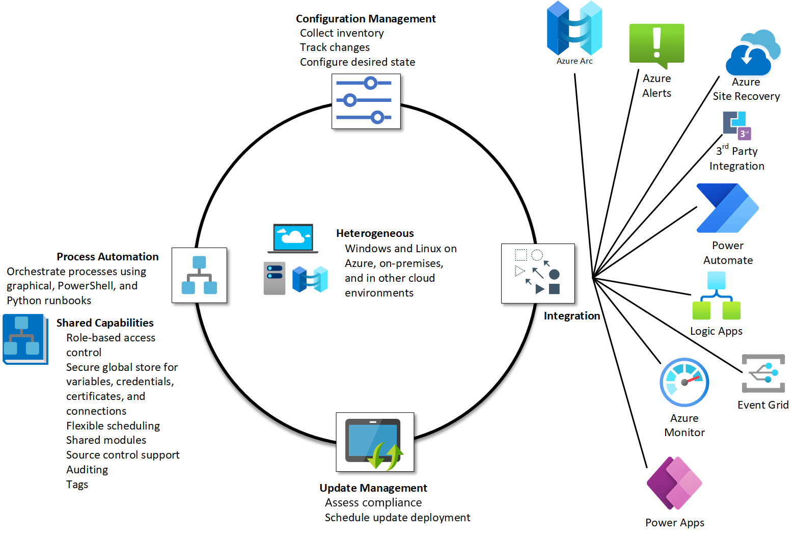

## 1. 概览

[Azure Automation](https://learn.microsoft.com/en-us/azure/automation/overview) 是一个整体的概念，它所描述的自动化包含上图所示的内容：

- **流程自动化 (Process Automation)**：通过 runbook 和 Azure 等其他服务的结合，实现自动化操作。
- **配置管理 (Configuration Management)**
  - **Change Tracking and Inventory**： 用于最终资源的变动。
  - **Azure Automation State Configuration**：和 [Terraform](https://en.wikipedia.org/wiki/Terraform_(software)) 类似的产品。用于部署和维护。

- **Update Management**：定期更新系统

## 2. 概念

- [Automation account](https://learn.microsoft.com/en-us/azure/automation/automation-security-overview) 用于管理所有自动化资源。使用自动化操作之前，必须创建或拥有至少一个 Automation account。