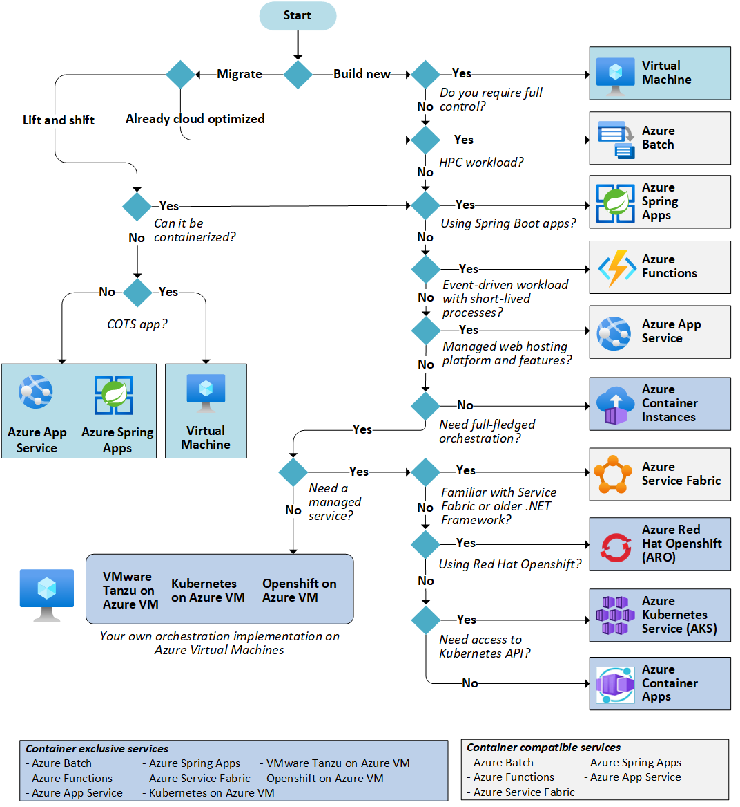

# 1. Compute Services

参考：**[Choose an Azure compute service](https://learn.microsoft.com/en-us/azure/architecture/guide/technology-choices/compute-decision-tree)**

名词解释：

- COTS app：COTS 是 Commercial Off-The-Shelf 的缩写，意思是商用现成产品。

  在计算机科学领域，COTS 指的是可以直接购买和使用的软件或硬件产品，而不需要自行开发。COTS 产品通常是经过测试和验证的，可以快速部署和集成到现有系统中，有助于节省时间和成本。

类型：

- [Azure Virtual Machines](https://learn.microsoft.com/en-us/azure/virtual-machines): A service where you deploy and manage virtual machines (VMs) inside an Azure virtual network.
- [Azure App Service](https://learn.microsoft.com/en-us/azure/app-service): A managed service for hosting web apps, mobile app back ends, RESTful APIs, or automated business processes.
- [Azure Functions](https://learn.microsoft.com/en-us/azure/azure-functions/functions-overview): A managed function as a service.
- [Azure Kubernetes Service](https://learn.microsoft.com/en-us/azure/aks/intro-kubernetes) (AKS): A managed Kubernetes service for running containerized applications.
- [Azure Container Apps](https://learn.microsoft.com/en-us/azure/container-apps): A managed service built on Kubernetes, which simplifies the deployment of containerized applications in a serverless environment.
- [Azure Container Instances](https://learn.microsoft.com/en-us/azure/container-instances/container-instances-overview): This service is a fast and simple way to run a container in Azure. You don't have to provision any VMs or adopt a higher-level service.
- [Azure Red Hat OpenShift](https://learn.microsoft.com/en-us/azure/openshift): A fully managed OpenShift cluster for running containers in production with Kubernetes.
- [Azure Spring Apps](https://learn.microsoft.com/en-us/azure/spring-apps): A managed service designed and optimized for hosting Spring Boot apps.
- [Azure Service Fabric](https://learn.microsoft.com/en-us/azure/service-fabric/service-fabric-overview): A distributed systems platform that can run in many environments, including Azure or on-premises.
- [Azure Batch](https://learn.microsoft.com/en-us/azure/batch/batch-technical-overview): A managed service for running large-scale parallel and high-performance computing (HPC) applications.
