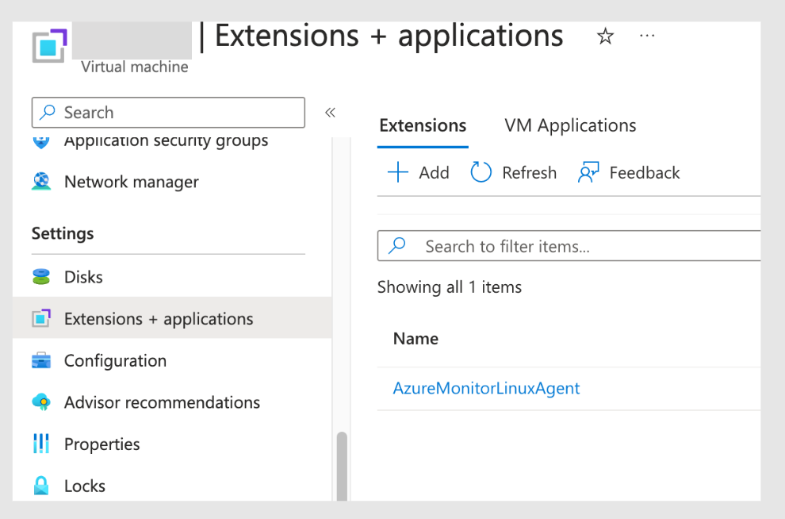

## Extensions

我们可以在导航栏的 **"Settings >> Extensions + applications"**，添加想要的插件。

常见的插件：

- Datadog Agent：用于上传日志到 Datadog 的 agent。

- Azure Automanage Machine Configuration extension：添加以下配置到虚拟机里
  - Operating system settings
  - Application configuration or presence
  - Environment settings

