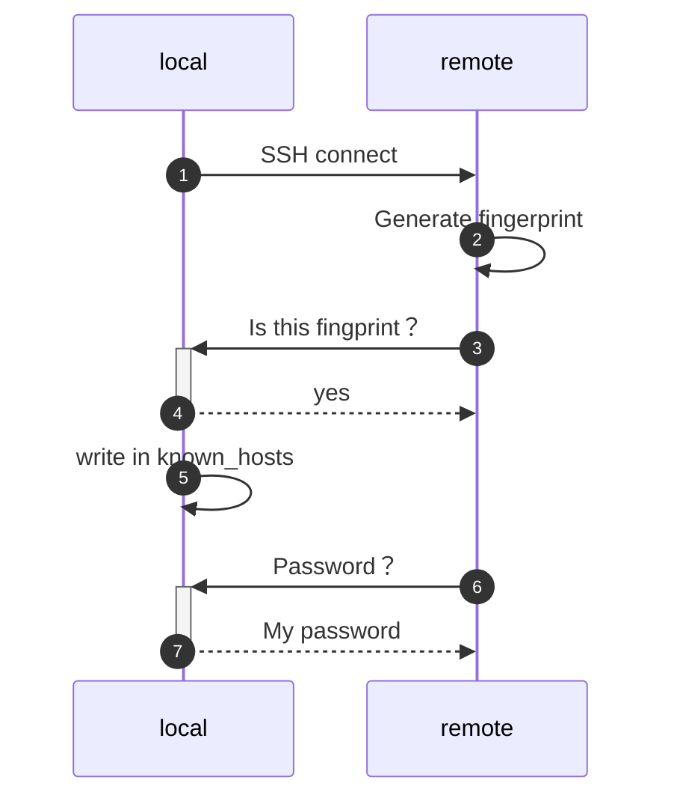

## 1. 定义 Definition

SSH (全称 Secure Shell Protocol) ，可理解成 **安全且可靠的保护壳协议**。首先，我们需要分清两个讲法：

- 通常我们说 SSH 时，是说 OpenSSH远程登录客户端。

   ```bash
   $ man ssh
   NAME
        ssh — OpenSSH remote login client
   ```

   而谈及 <u>SSH服务器</u> 时，则指代 <u>OpenSSH服务器</u>，通常指代的是 sshd（OpenSSH daemon）。

   包含 Windows 10 在内的绝大多数操作系统都是使用着 OpenSSH。<sup>[wiki](https://zh.wikipedia.org/wiki/Secure_Shell#OpenSSH%E5%92%8COSSH)</sup>

- 当谈及 <u>SSH协议</u> 时，才是指上述定义中的 Secure Shell Protocol。

就如同名字所示，SSH 是在不安的网络中，充当着可靠的保护壳的协议。<sup>[wiki](https://en.wikipedia.org/wiki/Secure_Shell_Protocol)</sup>


## 2. 如何运行 How does it work

由于没有找到具有权威的文章，所以我使用了代码对 <u>SSH的过程</u> 进行日志记录。代码参考 Sample_Java，得到的日志是这样：

```bash
# 使用密码登录远程SSH服务器

# 建立连接
INFO: Connecting to localhost port 22
# 这里应该有一步：
# 检查 fingerprint 是否正确。
INFO: Connection established

# SSH 版本
INFO: Remote version string: SSH-2.0-OpenSSH_8.2p1 Ubuntu-4ubuntu0.2
INFO: Local version string: SSH-2.0-JSCH-0.1.54

# 对称密钥算法Negotiate
# 本地
# Ciphers 加密
INFO: CheckCiphers: aes256-ctr,aes192-ctr,aes128-ctr,aes256-cbc,aes192-cbc,aes128-cbc,3des-ctr,arcfour,arcfour128,arcfour256
# Kex= key exchange. 密钥交换
INFO: CheckKexes: diffie-hellman-group14-sha1,ecdh-sha2-nistp256,ecdh-sha2-nistp384,ecdh-sha2-nistp521
# Signatures 验证
INFO: CheckSignatures: ecdsa-sha2-nistp256,ecdsa-sha2-nistp384,ecdsa-sha2-nistp521
INFO: SSH_MSG_KEXINIT sent
INFO: SSH_MSG_KEXINIT received
INFO: kex: server: curve25519-sha256,curve25519-sha256@libssh.org,ecdh-sha2-nistp256,ecdh-sha2-nistp384,ecdh-sha2-nistp521,diffie-hellman-group-exchange-sha256,diffie-hellman-group16-sha512,diffie-hellman-group18-sha512,diffie-hellman-group14-sha256
INFO: kex: server: rsa-sha2-512,rsa-sha2-256,ssh-rsa,ecdsa-sha2-nistp256,ssh-ed25519
INFO: kex: server: chacha20-poly1305@openssh.com,aes128-ctr,aes192-ctr,aes256-ctr,aes128-gcm@openssh.com,aes256-gcm@openssh.com
INFO: kex: server: chacha20-poly1305@openssh.com,aes128-ctr,aes192-ctr,aes256-ctr,aes128-gcm@openssh.com,aes256-gcm@openssh.com
INFO: kex: server: umac-64-etm@openssh.com,umac-128-etm@openssh.com,hmac-sha2-256-etm@openssh.com,hmac-sha2-512-etm@openssh.com,hmac-sha1-etm@openssh.com,umac-64@openssh.com,umac-128@openssh.com,hmac-sha2-256,hmac-sha2-512,hmac-sha1
INFO: kex: server: umac-64-etm@openssh.com,umac-128-etm@openssh.com,hmac-sha2-256-etm@openssh.com,hmac-sha2-512-etm@openssh.com,hmac-sha1-etm@openssh.com,umac-64@openssh.com,umac-128@openssh.com,hmac-sha2-256,hmac-sha2-512,hmac-sha1
INFO: kex: server: none,zlib@openssh.com
INFO: kex: server: none,zlib@openssh.com
INFO: kex: server: 
INFO: kex: server: 
INFO: kex: client: ecdh-sha2-nistp256,ecdh-sha2-nistp384,ecdh-sha2-nistp521,diffie-hellman-group14-sha1,diffie-hellman-group-exchange-sha256,diffie-hellman-group-exchange-sha1,diffie-hellman-group1-sha1
INFO: kex: client: ssh-rsa,ssh-dss,ecdsa-sha2-nistp256,ecdsa-sha2-nistp384,ecdsa-sha2-nistp521
INFO: kex: client: aes128-ctr,aes128-cbc,3des-ctr,3des-cbc,blowfish-cbc,aes192-ctr,aes192-cbc,aes256-ctr,aes256-cbc
INFO: kex: client: aes128-ctr,aes128-cbc,3des-ctr,3des-cbc,blowfish-cbc,aes192-ctr,aes192-cbc,aes256-ctr,aes256-cbc
INFO: kex: client: hmac-md5,hmac-sha1,hmac-sha2-256,hmac-sha1-96,hmac-md5-96
INFO: kex: client: hmac-md5,hmac-sha1,hmac-sha2-256,hmac-sha1-96,hmac-md5-96
INFO: kex: client: none
INFO: kex: client: none
INFO: kex: client: 
INFO: kex: client: 
INFO: kex: server->client aes128-ctr hmac-sha1 none
INFO: kex: client->server aes128-ctr hmac-sha1 none

# 发送新密钥
# https://datatracker.ietf.org/doc/html/rfc5656
# ECDH=Diffie-Hellman 
INFO: SSH_MSG_KEX_ECDH_INIT sent
INFO: expecting SSH_MSG_KEX_ECDH_REPLY

# 客户端校验服务端，判断服务端是否可信
INFO: ssh_rsa_verify: signature true
WARN: Permanently added 'localhost' (RSA) to the list of known hosts.

# 开始使用新的密钥，进行通信
INFO: SSH_MSG_NEWKEYS sent
INFO: SSH_MSG_NEWKEYS received

# 请求服务，服务器将进行验证
INFO: SSH_MSG_SERVICE_REQUEST sent
INFO: SSH_MSG_SERVICE_ACCEPT received
INFO: Authentications that can continue: publickey,keyboard-interactive,password
INFO: Next authentication method: publickey
INFO: Authentications that can continue: password
INFO: Next authentication method: password
INFO: Authentication succeeded (password).
```




### 2.1 (客户端)对服务端的校验 Verification of the server

当客户端访问服务器时，首先需要解决的是：服务端是否真实？

只要服务端使用私钥加密信息，客户端获得服务端的公钥，并使用公开解密信息即可。而这里的关键是，客户端如何获得一个**真实的公钥**？

SSH 采取的是：Fingerprint。Fingerprint 是公钥的哈希值，客户端事先知道哈希值，并且再第一次登录时候对比该哈希值。哈希值正确，则该服务器是真实的。

确认服务器是可靠的，那么客户端将会把公钥放到  ` ~/.ssh/known_hosts`。下次将自动使用公钥去对比哈希值，而不需要人为去确认。

---

细节：

- 客户端记录 公钥 的位置是：
  - 用户专属 ` ~/.ssh/known_hosts`（第一次访问时，点击确认后，将自动添加到此处）
  - 系统专属 `/etc/ssh/ssh_known_hosts`（手动）
- 服务器端的非对称密钥，又叫做 **Host Key** ，常见对称加密算法的有 RSA、ECDSA 。Host Keys 存储在 `/etc/ssh`，公钥的文件扩展名为 `.pub`，如：
  - `ssh_host_ed25519_key.pub`
  - `ssh_host_rsa_key.pub`
  - `ssh_host_ecdsa_key.pub`
  - ...

### 2.2 生成 session key 以及 Negotiate

session key 通常为对称密钥，因为非对称密钥加密时间长。

设置Key Exchange Algorithm : 

```properties
KexAlgorithms    curve25519-sha256,curve25519-sha256@libssh.org,ecdh-sha2-nistp256,ecdh-sha2-nistp384,ecdh-sha2-nistp521
```

### 2.3 (服务端)对客户端进行认证 Authentication of the client 

 Authentication method 有：

1. GSSAPI-based authentication 
2. host-based authentication
3. public key authentication
4. challenge-response authentication
5. password authentication

在验证时，会根据上方的 Authentication  method的顺序进行验证。可通过 `PreferredAuthentications` 修改默认顺序。<sup>[[openbsd]](http://man.openbsd.org/ssh.1#AUTHENTICATION)</sup> 由于 GSSAPI-based 验证时候过长，有一些应用会通过 disable 它，从而skip。

- 如果选择的是 password authentication ，那么将会校验密码。
- 如果选择 public key authentication ，那么将会 `~/.ssh/authorized_keys` 查找公开密钥，并校验。（示例参考 Docker）

## 3. 目录结构 Dir structure

```shell
$ ls -tlr /etc/ssh/ 
total 580
-rw-r--r-- 1 root root   3264 Mar  4  2019 sshd_config
-rw-r--r-- 1 root root   1580 Mar  4  2019 ssh_config
-rw-r--r-- 1 root root 553122 Mar  4  2019 moduli
-rw-r--r-- 1 root root    338 Feb 27  2020 ssh_import_id
-rw-r--r-- 1 root root    393 Feb 27  2020 ssh_host_rsa_key.pub
-rw------- 1 root root   1679 Feb 27  2020 ssh_host_rsa_key
-rw-r--r-- 1 root root    173 Feb 27  2020 ssh_host_ecdsa_key.pub
-rw------- 1 root root    227 Feb 27  2020 ssh_host_ecdsa_key
-rw-r--r-- 1 root root     93 Feb 27  2020 ssh_host_ed25519_key.pub
-rw------- 1 root root    399 Feb 27  2020 ssh_host_ed25519_key
```

- **sshd_config** : OpenSSH服务端 配置文件 <sup>[[来源]](https://linux.die.net/man/5/sshd_config)</sup> 
- **ssh_config** : OpenSSH客户端 配置文件

其他：

- 记录 <u>来自服务端公钥</u>：
  - `~/.ssh/known_hosts` 
  -  `/etc/ssh/ssh_known_hosts`
- 记录 <u>来自客户端公钥</u>
  - `~/.ssh/authorized_keys`


## 4. 工具 Tools

### 4.1 远程复制文件 SCP 

`scp` - secure copy （安全的复制）。`scp` 是基于 ssh 的文件传输工具——包含上传和下载。

### 4.2 SFTP

`sftp` - secure file transfer program. 行为和 FTP 协议类似，但是是基于 SSH。

### 4.3 密钥认证 ssh-keygen

`ssh-keygen` — OpenSSH authentication key utility

```shell
# 根据主机名，查找信息
# https://en.wikibooks.org/wiki/OpenSSH/Client_Configuration_Files#~/.ssh/known_hosts
# usage: ssh-keygen -F [hostname] 
$ ssh-keygen -F ubuntu | tee test01

# 生成密钥
ssh-keygen -t rsa

# hash 主机名
ssh-keygen -f  ~/.ssh/known_hosts  -H 

# 生成 Fingerprint
ssh-keygen -l -f /etc/ssh/ssh_host_rsa_key
```

### 4.4 认证代理 ssh-agent

ssh-agent 是一个代理，帮助用户管理密钥对。

### 4.5 第三方服务 Third-party service

**Cloudflare Access **提供了 <u>管理SSH密钥</u> 以及<u>单点登录</u>的服务，并且取缔了 private network 的不安全性。更多查看 [仅凭公钥无以保障SSH安全](https://blog.cloudflare.com/zh-cn/public-keys-are-not-enough-for-ssh-security-zh-cn/)。


## 延伸阅读 See Also

- [RedHat - 第 12 章 使用 OPENSSH 的两个系统间使用安全通讯](https://access.redhat.com/documentation/zh-cn/red_hat_enterprise_linux/8/html/configuring_basic_system_settings/using-secure-communications-between-two-systems-with-openssh_configuring-basic-system-settings)
- [阮一峰 - SSH原理与运用（一）：远程登录](http://www.ruanyifeng.com/blog/2011/12/ssh_remote_login.html)
- [ssh-agent代理的简单用法](https://bbs.huaweicloud.com/blogs/118363)

