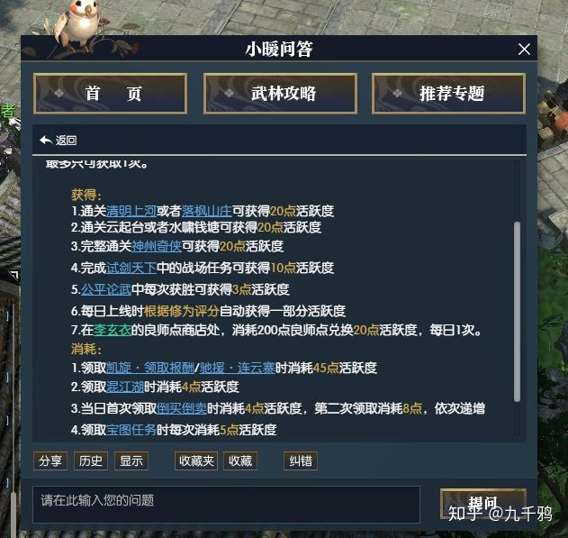

逆水寒的PVP系统主要分，传统PVP、野外PVP、帮战PVP。

传统的PVP模式，以回合制为主，也就是有时间限制。在逆水寒中的是论武、试剑天下、论武。分别对应着：

- 纯操作

- - 3v3（论武）

- 装备（静态数据）+操作（动态数据）

- - 6v6 （比武大会）
  - 12v12（试剑天下）

前者与后者的区别在于：**装备**。装备系统是许多游戏的经济来源，所以传统PVP需要考虑娱乐性和装备系统。换而言之，就是普通玩家玩得好，氪金玩家玩得爽，同时还要刺激玩家氪金或者肝。

理想中玩家的心态：

- 他/她比我厉害，就只是厉害在装备。

错误的：

- 他/她是一个不可逾越的存在。

策划应该让玩家有一种嫉妒的心理。于是乎，最理想的做法是分层进行PVP（总要有个人垫底或者不分上下）。而**层次模型**最重要的是，玩家的综合实力是逐渐上升的方式进行分层，而不能有跳跃性（实力分层），以及玩家基数需要大。

**逆水寒的层次模型**

逆水寒的层次模型，做得相当不好。

**1）实力分层/公平性**

由于系统设计的问题，导致普通玩家的装备都流向人民币玩家。导致了玩家明显分层了，而且差距很大。

**2）玩家基数**

玩家基数过少，原因以下：

- 奖励少。
- 公平性差。
- 游戏真做得差。
- ...（各种理由都有可能）

2.1）奖励：

- 装备升级所需的材料。

该奖励的消耗有两处：镶嵌以及升级玉、合成装备。因为**“镶嵌以及升级孔”是有上限**，所以策划通过控制该行为的消耗值进行游戏的寿命延长，而**合成装备**相对而言可以看作是一个**没有上限**的行为，所以可以较为宽松的管理。**装备需要换代是有损耗的**（如：强化从60级装备转移到70级装别上）。原先装备的提升是可以转移，不过只返回80%的奖励，也就是说20%是被消耗了。这一点上，我们也可以清晰看到策划的可持续发展的想法。

在整个游戏里，我们可以清晰地看到策划不断修改PVP的奖励的消耗，希望得到一个良好的可持续发展。

**理想：策划认为玩家会不断重锻装备并且升级玉，所以会积极参加PVP，并希望这种行为可持续。**

**事实：**

前期，一方面，装备流人民币玩家，也就导致普通玩家的原材料过少，所以声望需求少**（装备原材料少）**。一方面，合成装备所需要的交子多，且交子可以用于升级技能和升级属性**（交子不够用）**。合成门槛过高也是可能的**（铜钱消耗多）**。“镶嵌以及升级孔”会消耗大量交子，所以不能经常换。**（一些操作的性价比低）**

**后期：**

逆水寒通过减少PVE副本的活跃度，“鼓励”玩家去玩PVP。（不做解释）

**改善传统PVP方案：**

增加基数

- 拼凑：跨服进行匹配，这个对技术有要求，而且同时会减少一好处“同服玩家间脸熟”。
- 增加奖励，鼓励涌入：增加奖励是最直接最暴力的方式，比如增加交子奖励。
- 更改声望的消耗方法。

**番外：**

一些游戏，通过将装备分为PVP和PVE装备的形式将PVP系统和PVE系统分离，这种做法的好处在于减少了系统的复杂度，同时让玩家可自己选择。缺点在于系统间进行分离，可能导致两方面的玩家之间的联系减少，从而导致每个系统的游戏玩法的基数没那么大。可能是基于这种联系的重要性吧，逆水寒选择了让一个系统（PVE、PVX）的玩家服务另一个系统（作为牺牲品），因此，我们可以认为逆水寒是PVP游戏。但是如果作为PVP游戏，那么逆水寒就放弃作为开放世界游戏而存在。这算是真实的江湖吗，还是说是金钱的江湖？