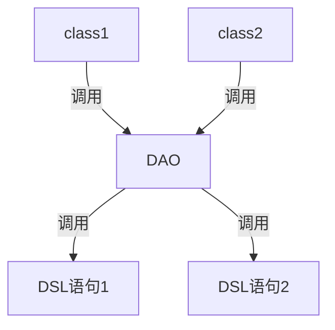
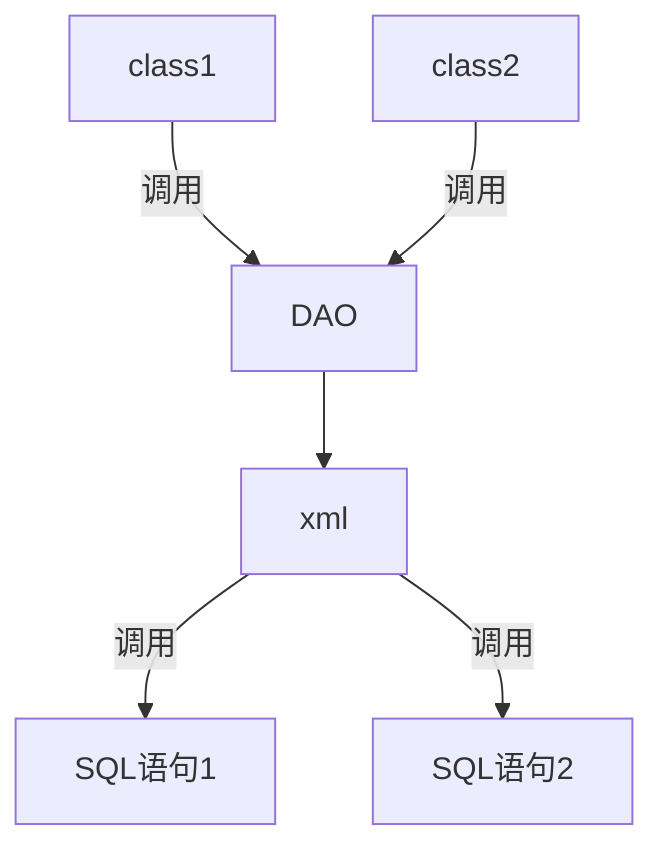
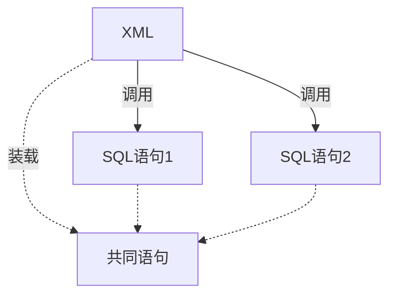

jOOQ 的流程如下：




## 数据库切换

使用 jOOQ 可以轻松跨数据库。在不修改代码（此处特指SQL语句）的情况下，切换数据库。

在现实场景中，我们不会随意的切换数据库，不会有项目随意从 MySQL 切换到 PSQL。原因：

- 数据库的 SQL语句 存在差异，即便 jOOQ 帮我们解决切换问题，但是我们不能保证我们使用的 DSL 语句能完全适用于 PSQL。这意味存在一定的风险，为了降低这种风险的可能性，团队往往需要再次进行人工测试。

但是在测试时，我们常常要使用 memory 数据库（如 H2）进行单元测试，此时使用 jOOQ 就能很好的保证我们的语句能在 H2 上运行，即便并非所有的 DSL 语句能通过测试，但是我们能测试绝大部分的 DSL 语句即可。剩下的 DSL 语句可以通过容器等技术启动一个新得 MySQL 再进行测试。


## 传统MyBatis

流程如下：



由于 MyBatis 使用纯粹的SQL语句，所以是与具体的数据库的SQL语句进行绑定，因此比 jOOQ 更容易出现无法使用 memory 数据库测试的情况。

由于 SQL 语句装载在另外的一个载体上，MyBatis 使用的是 XML。使用另外的载体有好处，也有坏处。



可以很方便的在同一个 XML文件中提取各个 SQL 语句的共同部分。但是载体也带来一定问题：

- 提取共同部分将会降低SQL语句的可读性。（于是乎，我们要抛出一个问题，<u>SQL语句需要提取共同部分吗？</u>）
- XML 文件可读性低。

## 融合度

由于 MyBatis 使用了 XML 文件，所以无法与 Java 文件很好地融合。MyBatis 为了与 Java 进行融合，采取了以下方式在 SQL 中引入变量：

```xml
<select id="selectPerson" parameterType="int" resultType="hashmap">
  SELECT * FROM PERSON WHERE ID = #{id}
</select>
```

该变量是来源于 Java 文件，一个变量放在两个文件中，降低了融合度。IDE 往往也无法直接通过 Java 文件找到对应的 tag 的变量。

由于 jOOQ 的DSL语句放在代码中，因此变量与DSL语句地融合度更高，而且方便使用者查看。

## 可读性

MyBatis 中使用的是 SQL 语句，从单纯的 SQL 角度而言，MyBatis 会更容易上手，如果不用 xml 中的奇奇怪怪的功能，可读性将会比 jOOQ 高。由于 Java 该语言能难创建 DSL，即便创建了也是一股 Java 风，所以相对难进行阅读。

