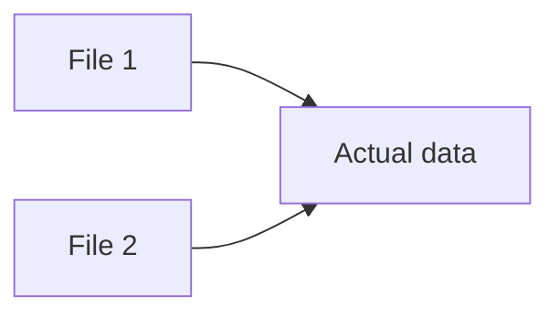

Linux 的command `ln` 用于链接文件。`ln` 有两个概念：**hard link** 和 **soft link** ：

## 文档内容

```shell
$ ln --help

Usage: ln [OPTION]... [-T] TARGET LINK_NAME   (1st form)
  or:  ln [OPTION]... TARGET                  (2nd form)
  or:  ln [OPTION]... TARGET... DIRECTORY     (3rd form)
  or:  ln [OPTION]... -t DIRECTORY TARGET...  (4th form)
In the 1st form, create a link to TARGET with the name LINK_NAME.
In the 2nd form, create a link to TARGET in the current directory.
In the 3rd and 4th forms, create links to each TARGET in DIRECTORY.
Create hard links by default, symbolic links with --symbolic.
By default, each destination (name of new link) should not already exist.
When creating hard links, each TARGET must exist.  Symbolic links
can hold arbitrary text; if later resolved, a relative link is
interpreted in relation to its parent directory.
# 默认创建hard links，使用--symbolic可创建symbolic/soft links
Mandatory arguments to long options are mandatory for short options too.
      --backup[=CONTROL]      make a backup of each existing destination file
  -b                          like --backup but does not accept an argument
  -d, -F, --directory         allow the superuser to attempt to hard link
                                directories (note: will probably fail due to
                                system restrictions, even for the superuser)
  -f, --force                 remove existing destination files
  -i, --interactive           prompt whether to remove destinations
  -L, --logical               dereference TARGETs that are symbolic links
  -n, --no-dereference        treat LINK_NAME as a normal file if
                                it is a symbolic link to a directory
  -P, --physical              make hard links directly to symbolic links
  -r, --relative              create symbolic links relative to link location
  -s, --symbolic              make symbolic links instead of hard links
  -S, --suffix=SUFFIX         override the usual backup suffix
  -t, --target-directory=DIRECTORY  specify the DIRECTORY in which to create
                                the links
  -T, --no-target-directory   treat LINK_NAME as a normal file always
  -v, --verbose               print name of each linked file
      --help     display this help and exit
      --version  output version information and exit

The backup suffix is '~', unless set with --suffix or SIMPLE_BACKUP_SUFFIX.
The version control method may be selected via the --backup option or through
the VERSION_CONTROL environment variable.  Here are the values:

  none, off       never make backups (even if --backup is given)
  numbered, t     make numbered backups
  existing, nil   numbered if numbered backups exist, simple otherwise
  simple, never   always make simple backups

Using -s ignores -L and -P.  Otherwise, the last option specified controls
behavior when a TARGET is a symbolic link, defaulting to -P.

GNU coreutils online help: http://www.gnu.org/software/coreutils/
Full documentation at: http://www.gnu.org/software/coreutils/ln
or available locally via: info '(coreutils) ln invocation'

```


## Hard Link



我们只有删除所有文件，真实数据才会删除。所有文件的状态是相同的。<sup>[[来源]](https://wiki.debian.org/ln)</sup>

```shell
# 创建hard link
$ ln File1 File2
$ ls -tlr
total 8
-rw-r--r-- 3 xiaojie xiaojie 806 Dec 23  2019 File2
-rw-r--r-- 3 xiaojie xiaojie 806 Dec 23  2019 File1
# 两个文件的大小均是806，数据是一模一样
```

## Soft Link


```shell
# 创建soft link
$ ln -s File1 File3
$ ls -ltr
total 8
-rw-r--r-- 3 xiaojie xiaojie 806 Dec 23  2019 File2
-rw-r--r-- 3 xiaojie xiaojie 806 Dec 23  2019 File1
lrwxrwxrwx 1 xiaojie xiaojie   5 Oct  2 01:07 File3 -> File1
# soft link文件大小为5，大多数据与File1不相同
```

Soft link，别名symbolic link（译为象征链接），与shortcut（快捷方式）相似<sup>[[wiki]](https://en.wikipedia.org/wiki/Symbolic_link)</sup>。

```shell
$ rm File1
$ ls -tlr
total 4
-rw-r--r-- 2 xiaojie xiaojie 806 Dec 23  2019 File2
lrwxrwxrwx 1 xiaojie xiaojie   5 Oct  2 01:07 File3 -> File1
# 即便删除了F1le1,File3仍然链接着File1
```

## 应用

### Deployment

当 deploy 时，我们常常需要部署各种资源，我们可以通过 soft link 进行部署文件，日后资源更新时候，soft link根据地址查找最新的资源。如果使用 hark link ,那么资源更新后将不会生效，因为原有资源仍然被保留。


