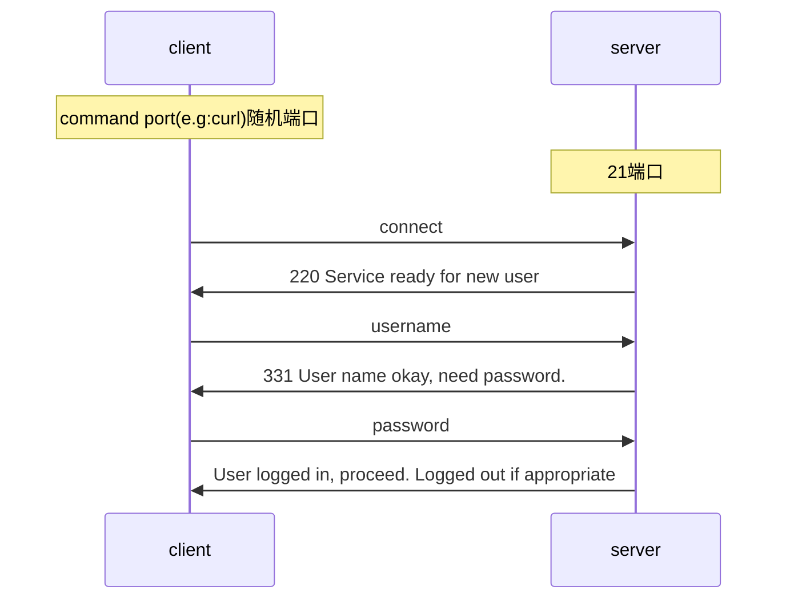
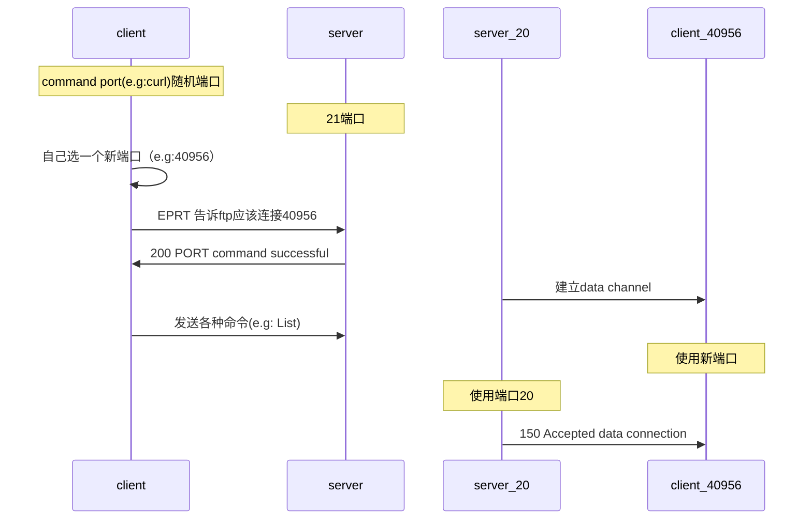
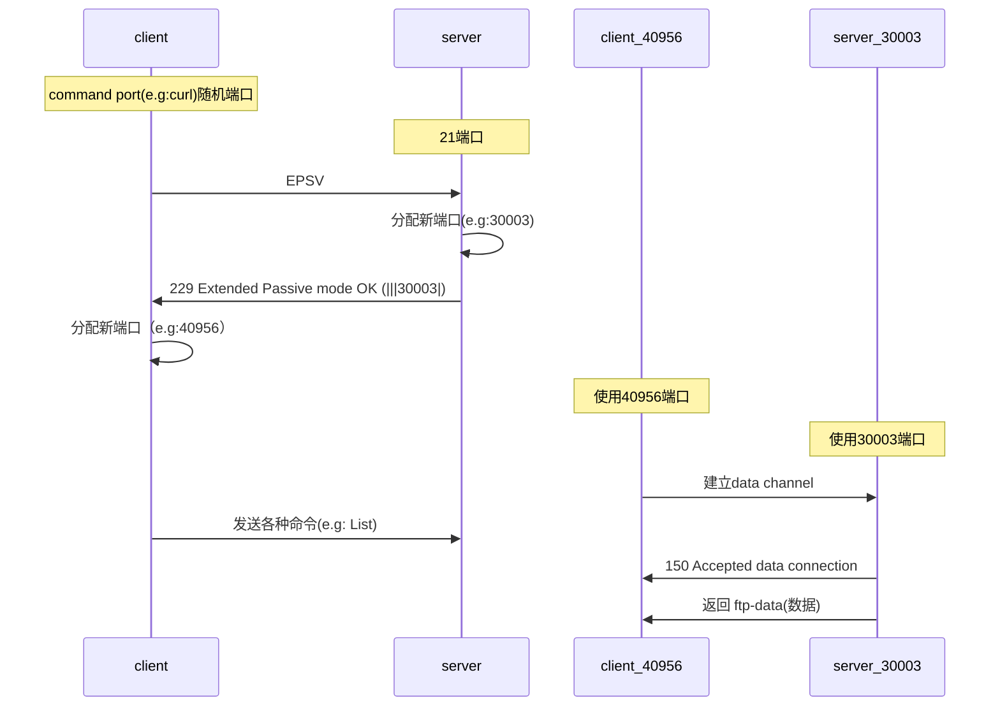

FTP<sup> File Transfer Protocol</sup>，是用于网络传输文件的协议。

## Data Connection

FTP有 active 和 passive 两个模式，定义了 data connection 是如何建立的。他们在验证用户和密码的步骤是相同的：



```
*   Trying 127.0.0.1...
* TCP_NODELAY set
* Connected to localhost (127.0.0.1) port 21 (#0)
< 220---------- Welcome to Pure-FTPd [privsep] [TLS] ----------
< 220-You are user number 1 of 5 allowed.
< 220-Local time is now 11:52. Server port: 21.
< 220-This is a private system - No anonymous login
< 220-IPv6 connections are also welcome on this server.
< 220 You will be disconnected after 15 minutes of inactivity.
# 明文（clear text）发送用户名
> USER username
< 331 User username OK. Password required
# 明文（clear text）发送密码
> PASS mypass
< 230 OK. Current directory is /
```

return code<sup>返回码</sup> 参考 [wiki](https://en.wikipedia.org/wiki/List_of_FTP_server_return_codes)。而两者的**区别**在于建立链接，FTP的数据传输是使用 <u>data channel</u>，而 Active Mode 中的 data channel 是由服务器建立的，而 Passive Mode 是由客户端建立起来。一般而言，防火墙不允许任何外部机器向本机建立起链接，所以大家默认使用 Passive Mode。<sup>[[参考]](https://stackoverflow.com/questions/1699145/what-is-the-difference-between-active-and-passive-ftp)</sup> 

### Active Mode



```shell
> EPRT |1|127.0.0.1|51801|
* ftp_perform ends with SECONDARY: 1
< 200 PORT command successful
* Connect data stream actively
```

### Passive  Mode



```shell
> EPSV
* Connect data stream passively
* ftp_perform ends with SECONDARY: 0
< 229 Extended Passive mode OK (|||30003|)
*   Trying 127.0.0.1...
* TCP_NODELAY set
* Connecting to 127.0.0.1 (127.0.0.1) port 30003
* Connected to localhost (127.0.0.1) port 21 (#0)
```

### connect之后的curl内容

```shell
# 查看目录
> LIST
< 150 Accepted data connection
* Maxdownload = -1
-rw-r--r--    1 1000       ftpgroup            0 Oct  3 11:00 aaa
-rw-r--r--    1 1000       ftpgroup            0 Oct  3 09:46 test.txt
* Remembering we are in dir ""
```

## Security

FTP 可通过以下命令进行登录。

```shell
$ curl -u ${用户名}:${密码} ftp://${地址}/${目录}
```

而 `curl`  当没有指定任何 authentication method 时，默认使用 basic authentication。<sup>[[curl]](https://curl.haxx.se/docs/manpage.html#--basic)</sup> 总所周知，basic authentication 是明文发送用户和密码，所以公开环境不安全。通过 `-v` 可以查看到发送的用户和密码，详情参考 [实验](#curl下操作) 章节。

```shell
# -v
$ curl -u -v ${用户名}:${密码} ftp://${地址}/${目录}
```

## 实验

### 启动FTP Server

在安装好Docker和Docker-compose之后，找一个 FTP的容器启动，常见的 FTP软件有：pure-ftpd、vsftpd等。其区别不在本文的讨论范围了。

本例使用的是 [stilliard](https://github.com/stilliard)/**[docker-pure-ftpd](https://github.com/stilliard/docker-pure-ftpd)**，我们先下载 `docker-compose.yaml` 文件：

```shell
# download docker-compose.yml
$ wget https://raw.githubusercontent.com/stilliard/docker-pure-ftpd/master/docker-compose.yml
```

查看（并修改）配置：

```shell
$ cat docker-compose.yml
```

```dockerfile
version: '3'

# Usage example: https://github.com/stilliard/docker-pure-ftpd/wiki/Docker-stack-with-Wordpress-&-FTP

services:
  ftpd_server:
    image: stilliard/pure-ftpd
    container_name: pure-ftpd
    ports:
      - "21:21"
      - "30000-30009:30000-30009"
    volumes: # remember to replace /folder_on_disk/ with the path to where you want to store the files on the host machine
      - "/folder_on_disk/data:/home/username/"
      - "/folder_on_disk/passwd:/etc/pure-ftpd/passwd"
# uncomment for ssl/tls, see https://github.com/stilliard/docker-pure-ftpd#tls
#      - "/folder_on_disk/ssl:/etc/ssl/private/"
    environment:
      PUBLICHOST: "localhost" #
      FTP_USER_NAME: username 	# 用户
      FTP_USER_PASS: mypass 	# 密码
      FTP_USER_HOME: /home/username
# also for ssl/tls:
#      ADDED_FLAGS: "--tls=2"
    restart: always
```

后台启动FTP Server：

```shell
# run in backgroup
$ docker-compose up -d
```

### 实验过程

#### 登录

我们可以使用GUI界面的工具，如：Intellij「Tools | Deployment | Configuration」中的FTP功能，访问FTP server。也可以用Linux的 `ftp` command 或者浏览器进行登录：

```shell
$ ftp localhost
220---------- Welcome to Pure-FTPd [privsep] [TLS] ----------
220-You are user number 1 of 5 allowed.
220-Local time is now 10:27. Server port: 21.
220-This is a private system - No anonymous login
220-IPv6 connections are also welcome on this server.
220 You will be disconnected after 15 minutes of inactivity.
Name (localhost:xiaojie): username # 用户名
331 User username OK. Password required
Password: mypass #密码
230 OK. Current directory is /
Remote system type is UNIX.
Using binary mode to transfer files.
ftp> 
```

#### active 模式下操作

登录成功后，我们尝试使用`ls`命令：

```shell
ftp> ls
# 只能在 172.18.0.1 下打开链接
500 I won't open a connection to 127.0.0.1 (only to 172.18.0.1)
ftp: bind: Address already in use
```

无法在docker的宿主主机下执行 `ls` 命令。而 `172.18.0.1` 这个网络是，刚刚容器所处的网络：

```shell
$ docker inspect --format '{{ .IPAM }}' ftp_default  
{default map[] [{172.18.0.0/16  172.18.0.1 map[]}]}
```

我们通过docker进行操作，验证猜测：

```shell
# 直接操作容器
$ docker container exec -it pure-ftpd bash
# 下载ftp client命令工具
$ apt-get update -y 
$ apt-get install -y ftp

$ ftp localhost
# 输入用户名：username
# 输入密码：mypass
ftp> ls
200 PORT command successful
150 Connecting to port 48357
```

#### passive 模式下操作

```shell
$ ftp localhost
# 用户密码登录

# 操作失败
ftp> ls
500 I won't open a connection to 127.0.0.1 (only to 172.18.0.1)
ftp: bind: Address already in use

# passive
ftp> passive
Passive mode on.

#操作成功
ftp> ls
227 Entering Passive Mode (127,0,0,1,117,50)
150 Accepted data connection
-rw-r--r--    1 1000       ftpgroup            0 Oct  3 11:00 aaa
-rw-r--r--    1 1000       ftpgroup            0 Oct  3 09:46 test.txt
226-Options: -l 
226 2 matches total
ftp> 

```

#### curl下操作

##### curl-Passive Mode

```shell
# -u, --user
$ curl -u username:mypass ftp://localhost/
-rw-r--r--    1 1000       ftpgroup            0 Oct  3 11:00 aaa
-rw-r--r--    1 1000       ftpgroup            0 Oct  3 09:46 test.txt

# what's going on under the hood
#  '>' means "header data" sent by curl 
#  '<' means "header data" received by curl
#  '*' means additional info provided by curl
$ curl -u username:mypass ftp://localhost/ -v
*   Trying 127.0.0.1...
* TCP_NODELAY set
* Connected to localhost (127.0.0.1) port 21 (#0)
< 220---------- Welcome to Pure-FTPd [privsep] [TLS] ----------
< 220-You are user number 1 of 5 allowed.
< 220-Local time is now 11:52. Server port: 21.
< 220-This is a private system - No anonymous login
< 220-IPv6 connections are also welcome on this server.
< 220 You will be disconnected after 15 minutes of inactivity.
# 明文（clear text）发送用户名
> USER username
< 331 User username OK. Password required
# 明文（clear text）发送密码
> PASS mypass
< 230 OK. Current directory is /
> PWD
< 257 "/" is your current location
* Entry path is '/'
> EPSV
* Connect data stream passively
* ftp_perform ends with SECONDARY: 0
< 229 Extended Passive mode OK (|||30003|)
*   Trying 127.0.0.1...
* TCP_NODELAY set
* Connecting to 127.0.0.1 (127.0.0.1) port 30003
* Connected to localhost (127.0.0.1) port 21 (#0)
> TYPE A
< 200 TYPE is now ASCII
> LIST
< 150 Accepted data connection
* Maxdownload = -1
-rw-r--r--    1 1000       ftpgroup            0 Oct  3 11:00 aaa
-rw-r--r--    1 1000       ftpgroup            0 Oct  3 09:46 test.txt
* Remembering we are in dir ""
< 226-Options: -l 
< 226 2 matches total
* Connection #0 to host localhost left intact

```

##### curl-Active Mode

在Docker 容器中执行：Active mode：

```shell

# curl -u username:mypass ftp://localhost/ -v --ftp-port lo
* Expire in 0 ms for 6 (transfer 0x55fc58a88f50)
* Expire in 1 ms for 1 (transfer 0x55fc58a88f50)
* Expire in 0 ms for 1 (transfer 0x55fc58a88f50)
* Expire in 1 ms for 1 (transfer 0x55fc58a88f50)
* Expire in 0 ms for 1 (transfer 0x55fc58a88f50)
* Expire in 0 ms for 1 (transfer 0x55fc58a88f50)
* Expire in 1 ms for 1 (transfer 0x55fc58a88f50)
* Expire in 0 ms for 1 (transfer 0x55fc58a88f50)
* Expire in 0 ms for 1 (transfer 0x55fc58a88f50)
* Expire in 1 ms for 1 (transfer 0x55fc58a88f50)
* Expire in 0 ms for 1 (transfer 0x55fc58a88f50)
* Expire in 0 ms for 1 (transfer 0x55fc58a88f50)
* Expire in 1 ms for 1 (transfer 0x55fc58a88f50)
* Expire in 0 ms for 1 (transfer 0x55fc58a88f50)
* Expire in 0 ms for 1 (transfer 0x55fc58a88f50)
* Expire in 1 ms for 1 (transfer 0x55fc58a88f50)
* Expire in 0 ms for 1 (transfer 0x55fc58a88f50)
* Expire in 0 ms for 1 (transfer 0x55fc58a88f50)
* Expire in 1 ms for 1 (transfer 0x55fc58a88f50)
* Expire in 0 ms for 1 (transfer 0x55fc58a88f50)
* Expire in 0 ms for 1 (transfer 0x55fc58a88f50)
* Expire in 1 ms for 1 (transfer 0x55fc58a88f50)
* Expire in 0 ms for 1 (transfer 0x55fc58a88f50)
* Expire in 0 ms for 1 (transfer 0x55fc58a88f50)
* Expire in 1 ms for 1 (transfer 0x55fc58a88f50)
* Expire in 0 ms for 1 (transfer 0x55fc58a88f50)
* Expire in 0 ms for 1 (transfer 0x55fc58a88f50)
* Expire in 1 ms for 1 (transfer 0x55fc58a88f50)
* Expire in 0 ms for 1 (transfer 0x55fc58a88f50)
* Expire in 0 ms for 1 (transfer 0x55fc58a88f50)
* Expire in 0 ms for 1 (transfer 0x55fc58a88f50)
*   Trying 127.0.0.1...
* TCP_NODELAY set
* Expire in 150000 ms for 3 (transfer 0x55fc58a88f50)
* Expire in 200 ms for 4 (transfer 0x55fc58a88f50)
* Connected to localhost (127.0.0.1) port 21 (#0)
< 220---------- Welcome to Pure-FTPd [privsep] [TLS] ----------
< 220-You are user number 1 of 5 allowed.
< 220-Local time is now 14:21. Server port: 21.
< 220-This is a private system - No anonymous login
< 220-IPv6 connections are also welcome on this server.
< 220 You will be disconnected after 15 minutes of inactivity.
> USER username
< 331 User username OK. Password required
> PASS mypass
< 230 OK. Current directory is /
> PWD
< 257 "/" is your current location
* Entry path is '/'

# 开始与passive mode不同
> EPRT |1|127.0.0.1|51801|
* ftp_perform ends with SECONDARY: 1
< 200 PORT command successful
* Connect data stream actively
> TYPE A
< 200 TYPE is now ASCII
> LIST
< 150 Connecting to port 51801
* Maxdownload = -1
* Preparing for accepting server on data port
* Checking for server connect
* Ready to accept data connection from server
* Connection accepted from server
-rw-r--r--    1 1000       ftpgroup            0 Oct  3 11:00 aaa
-rw-r--r--    1 1000       ftpgroup            0 Oct  3 09:46 test.txt
* Remembering we are in dir ""
< 226-Options: -l 
< 226 2 matches total
* Connection #0 to host localhost left intact

```

#### tcpdump抓包

```shell
# terminal-1
$ ifconfig
...
lo: flags=73<UP,LOOPBACK,RUNNING>  mtu 65536
        inet 127.0.0.1  netmask 255.0.0.0
        inet6 ::1  prefixlen 128  scopeid 0x10<host>
        loop  txqueuelen 1000  (Local Loopback)
        RX packets 308096  bytes 18493769 (18.4 MB)
        RX errors 0  dropped 0  overruns 0  frame 0
        TX packets 308096  bytes 18493769 (18.4 MB)
        TX errors 0  dropped 0 overruns 0  carrier 0  collisions 0
...
# 观察的 interface 是 lo
# 抓包并输出成 tcp.log 文件
$ sudo tcpdump -i lo -w tcp.log
```

```shell
# terminal-2
$ curl -u username:mypass ftp://localhost/ -v
# command 输入完毕后记得关闭 terminal-1 的tcpdump
```

通过wireshark观察数据：

1. *File>Open* 打开文件
2. *filter* 处输入 *ftp*


我们观察到 `curl` 使用的 Port 是43230，即 `curl` 使用的是随机端口。

3. *filter* 处输入 *ftp-data*


我们发现了server和本地都用了不同的端口。以及发送数据使用的 request 

## 相关文章

- [FTPS（基于 SSL 的FTP）与 SFTP（SSH 文件传输协议）对比](https://linux.cn/article-8339-1.html)  