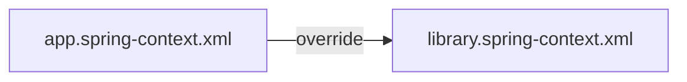
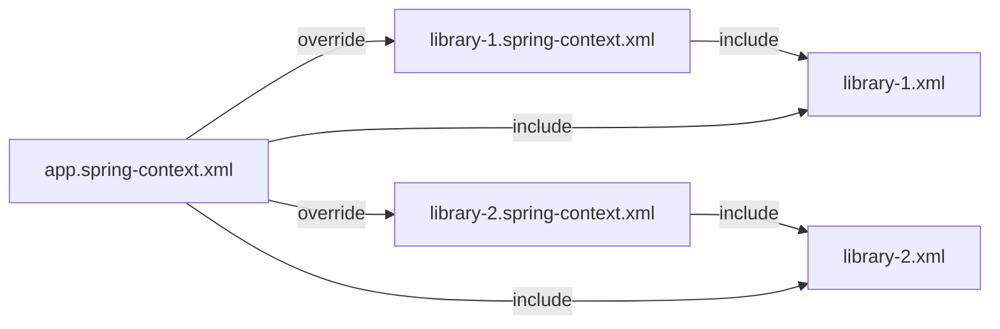
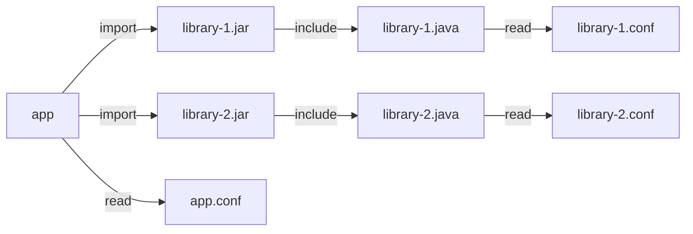

## 配置文件

### 依赖问题

#### 情景

现有两个项目：Web程序，后台程序。它们都需要使用service层、dao层连接数据库。此时，我们就想将service、dao层移除出去成为一个library。于是乎，我们创建了一个项目，叫：MyDataLibarry。我们的模块结构是这样的：

```
/- app-1(web)
/- app-2(daemon)
/- library(MyDataLibarry)
```

当我们使用spring时，我们会发现，每一个项目都会有自己的 [application.properties](https://docs.spring.io/spring-boot/docs/current/reference/html/appendix-application-properties.html) 当中放了spring的配置，不仅如此，我们还有 [spring-context.xml](https://docs.spring.io/spring-framework/docs/4.2.x/spring-framework-reference/html/xsd-configuration.html) 用于管理beans，以及我们自定义的各种各样的配置：

```
/- app-1(web)
	/- application.properties
	/- spring-context.xml
/- app-2(daemon)
	/- application.properties
	/- spring-context.xml
/- library(MyDataLibarry)
	/- application.properties
	/- spring-context.xml
```

一般情况下，app 调用 library 时，会将 library 的配置覆盖掉。

```
/- app-1(web)
	/- application.properties  <--生效
	/- spring-context.xml
/- library(MyDataLibarry)
	/- application.properties  <--被覆盖
	/- spring-context.xml
```

#### 方案一  pure config

由于不少程序，它们的配置文件是默认指定在某一个地方，所以只能进行覆盖，因此 app 和 library 的关系是这样:



此时，我们可以将 app 的 spring-context.xml 看作目录+配置文件。它可以像目录一样，链接着其他项目的配置文件：



```xml
#library-1的spring-context.xml内容为：
<import resource="classpath:library-1.xml" />

#library-2的spring-context.xml内容为：
<import resource="classpath:library-2.xml" />
```

```xml
# app的spring-context.xml内容为
<import resource="classpath:library-1.xml" />
<import resource="classpath:library-2.xml" />
```

同时，对于本项目有关的配置，也仍旧可以放在这里，就像这样：

```xml
# app的spring-context.xml内容为
# 连接
<import resource="classpath:library-1.xml" />
<import resource="classpath:library-2.xml" />

<context:component-scan base-package="org.app"/>
...
```

#### 方案二 with code

读取配置文件的任务交给源代码，因为源代码不可能重复，所以配置文件不会冲突。



在Spring中则是通过 [@Configuration](https://docs.spring.io/spring-framework/docs/current/javadoc-api/org/springframework/context/annotation/Configuration.html) 和 [@PropertySource](https://docs.spring.io/spring-framework/docs/current/javadoc-api/org/springframework/context/annotation/PropertySource.html) 的组合方式完成。

```java
@Configuration // 让Spring找到该Java格式的配置文件
@PropertySource("classpath:other.properties") // 引入其他properties或者yml格式的配置文件
public class AppConfig{}
```

#### 方案三 with env or command

方案三和方案二类型类似。方案二将配置放在代码里，比较适合不擅长命令行的Java团队；方案三则比较灵活。

在 spring 中方案三叫做 [Externalized Configuration ](https://docs.spring.io/spring-boot/docs/current/reference/html/spring-boot-features.html#boot-features-external-config)（外化配置），通过这种方式，我们可以将所有模块的配置文件集中在同一个文件夹当中

```
/- app(web)
/- library(MyDataLibarry)
```

```shell
$ ls your/config/dir/
app.yml		library.yml
$ java -jar app.jar  -Dspring.config.location=your/config/dir/
```

但是使用该方案，就尽量不要在各自的模块中添加配置文件。


### 不同环境

#### 场景

一般项目会有若干个环境，如：开发环境<sup>Development environment</sup>、验证环境<sup>Verification environment</sup>、产品环境<sup>production environment</sup>等等。那么如何配置这些环境呢？

#### 方案一

在 Spring 里，配置文件可以通过 [profile](https://docs.spring.io/spring-boot/docs/1.1.x/reference/html/boot-features-profiles.html) 配置若干的环境

```yaml
---
my.property: fromyamlfile
---
spring:
    profiles: development
server:
    port: 9001
---
spring:
    profiles: production
server:
    port: 8080
```

这种方案可以方便操作人员随时切换环境，但是存在安全忧患。所以在真正部署上线时，尽可能将没必要且存在安全隐患的信息删除

#### 方案二

使用 maven 或者 Gradle 等构建自动化工作。等你要使用哪种环境配置文件，就让自动化工具使用那种环境的配置文件覆盖：

```shell
app
/--app.conf
/--dev.conf
/--prod.conf

# 想要使用开发环境
# Gradle构建时；
Gradle: mv dev.confg app.conf
```

使用该方案也是需要注意保管配置文件的安全，其次是在配置文件更新时，需要<u>重新构建</u>或执行对应的<u>task</u>。这种方案相比之下，有点麻烦。

#### 方案三

也可以不进行<u>移动覆盖</u>，通过命令行的方式指定。

