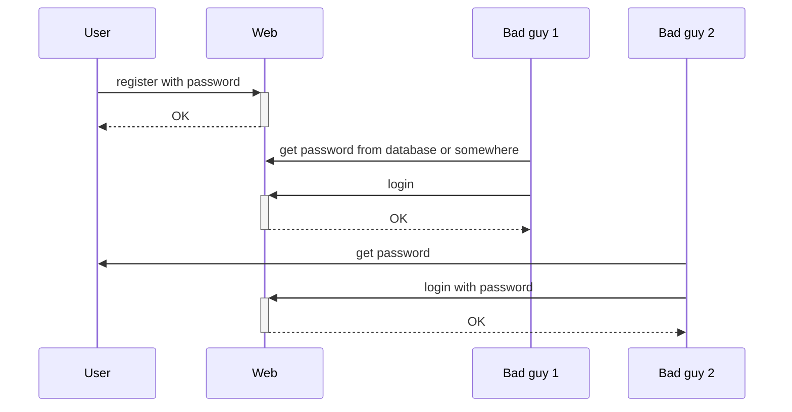
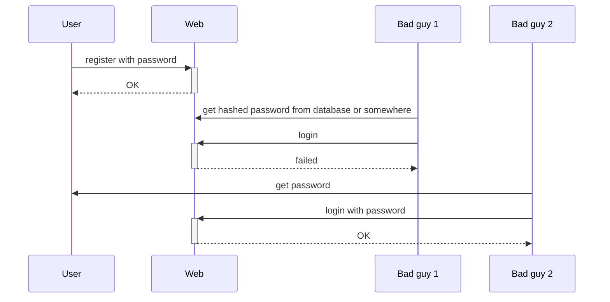
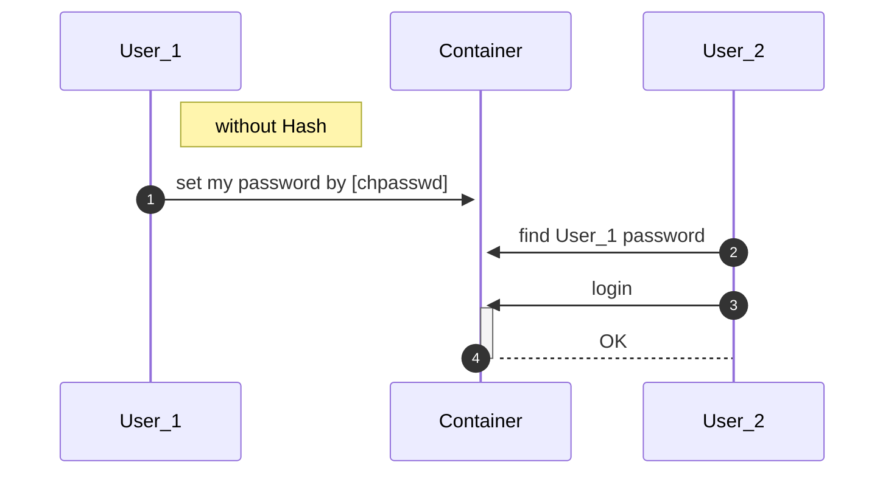
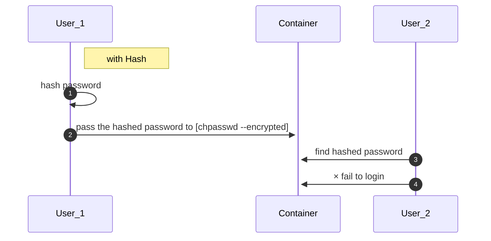

因为 password 与其hash之后的 password 是不可逆的。


## Procedure

### Without Hash

没有使用hash加密的web应用通常是这样的：



坏人可以通过Web系统的数据库或者在整个操作中的某一个漏洞中获取的密码，登录Web系统；坏人当然也可以通过User那边获取密码，进行登录。

### With hash



从上图，我们可以知道 hashed password 的主要功能的是**预防 Server 方因为自身的过失导致密码泄露**。另一点，就是**确保 password 只存在 User 自己手上**，其他人没有备份。

## 其他示例

### 容器中如何存储用户密码？

由于Docker容器会记录容器中的所有操作，所以如果我们：

```shell
$ echo "user1:user1password" | chpasswd
```

那么，其他人查看容器的日志时，将会发现用户` user1` 的密码是 `user1password`。



为了解决该问题，可以使用 pre-hash password。

```shell
$ echo 'user1:$6$lAkdPbeeZR7YJiE3$ohWgU3LcSVit/hEZ2VOVKvxD.67.N9h5v4ML7.4X51ZK3kABbTPHkZUPzN9jxQQWXtkLctI0FJZR8CChIwz.S/' | chpasswd --encrypted
```

我们告诉了 `chpasswd`  command，我们传送的是 hashed password，所以其他用户只能看到 hashed password。而当我们登录时，就要使用真正的 password，不能使用该 hashed password。而其他人知道 hashed password，却无法根据它进行反推出 password，所以即便被知道了也无所谓。<sup>[docker-sshd](https://github.com/panubo/docker-sshd)</sup>



