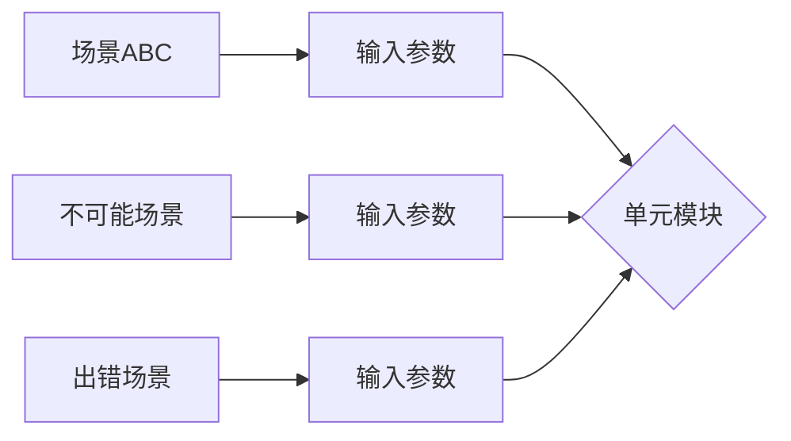
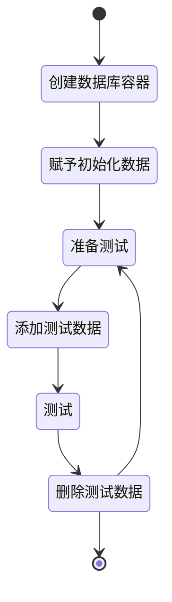
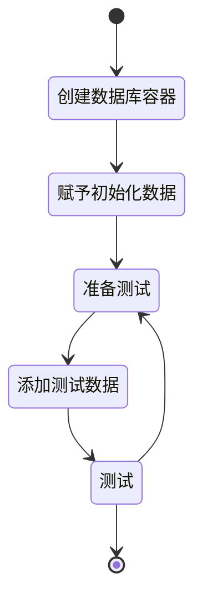
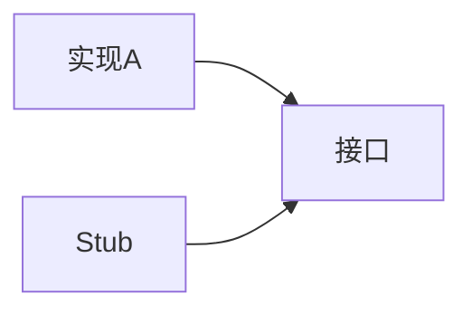
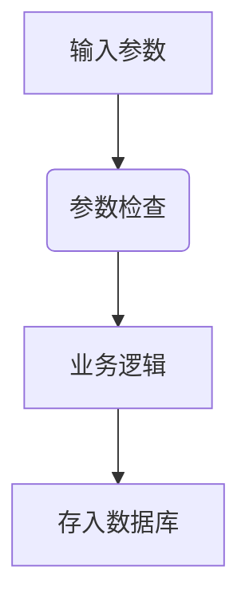

编写测试代码从实施阶段分类，可以分为：

- 开发阶段
- 产品阶段

开发阶段编写的测试代码，随着项目的成长，从<u>单元测试</u>Unit Testing代码也跟着成长为<u>集成测试</u>Integration Testing。而产品阶段编写的测试代码，我们也可以叫补代码，这个阶段往往是因为项目需要扩展，因此项目代码需要改动。由于改动代码而造成Bug过多，至于损失远高于补充测试代码的成本。因此此时需要**补**测试代码，减少Bug带来的损失。

## 集成测试与单元测试

不管是产品阶段，还是开发阶段，不管是单元测试，还是集成测试，编写测试代码的目的都是为了确保程序能够正常运行。既然，单元测试能确保程序正常性，集成测试也能确保程序的正确性，那么

- **集成测试可以代替单元测试吗？**
- **单元测试可以代替集成测试吗？**

- **单元测试与集成测试之间有什么关系？**

谈及**单元测试**时，我们必须思考**什么是单元？**在谈及面向对象语言时，我们会说 **「Object are the basic unit of OOP」**，这里也同样使用到 unit 一词。于是乎，Java程序员会倾向于将两者画上等于号「Unit of OOP == Unit of unit testing」，换言之「The basic unit of unit testing is objects/classes」。但实质上，单元测试的单元没有指定具体的范围，单元可大可小。

单元测试的输入参数可以随便输入，所以测试的范围相对全面，这当中包含了不可能的参数。出现不可能的参数的原因可能是，上一个单元不允许或不可能实现。

由于一个程序是由若干个单元连接成，所以集成测试的实质是若干个单元的排列组合。也就是说，如果拥有3个单元，每个单元拥有4个场景，那么集成测试想要完整测试所有情况，就必须测试 `3*4` 次。

实际情况下，我们**往往不会用集成测试代替单元测试**。这是因为集成测试所需要的准备十分多。举个场景，点击某一个用户名，将返回某一个用户名的特定信息。该例子如果使用集成测试来测试话，我们必须：

1. 通过程序入口增加用户A和用户B，用户B用于点击

2. 使用户B为登录状态
3. 模拟点击事件，并从response中获取用户A信息，并对这些信息进行判断。

而如果我们使用单元测试进行测试，那么我们只需要对「返回用户信息」的那个函数进行测试即可。而从该例子中，我们发现单元测试似乎十分简单便利，减少了很多重复操作，但是别忘记**「单元测试拥有前提」**。上述例子中，我们将很多东西作为默认前提，并认为是真。但实际上，我们会遗漏一些假设，如果程序中使用了切面、静态块，如果点击事件不仅仅发送了一个 request ，那么当我们没有将这些内容加入假设中，我们的**假设/前提可能是不全面**的。

单元测试处于前提不全面，这是常态。因此想要通过堆积单元测试从而代替集成测试，这是十分费劲的。集成测试的一个重要作用在乎测试单元测试所没有测到的**衔接点**，通过测试衔接点，从而提高程序的正确性。

在没有单元测试的程序中，通过直接添加集成测试，可以确保程序的基础流程是正确的。但是缺少单元测试的程序，一旦出现 bug，往往无法直接确认出错地点，单元测试在这里**提供了一个坐标**。当然，如果该 bug 是单元测试的 pattern 以外，那么单元测试将无法提供坐标。而在发现该错误之后，我们必须补充单元测试。

### 之外的测试代码

我们常常将测试代码分为：单元测试、集成测试，而前者往往被定义为测试项目中的颗粒度较小的单元，而后者被定义为测试整个项目的所有代码，这包含外部依赖。而这两者以外有：

- 颗粒度介于单元测试和集成测试
- 不包含**所有**外部依赖（如数据库）的集成测试
- 包含外部依赖的单元测试

在单元测试和集成测试之间的测试，我们既可以认为**稍微大一些的「单元测试」**，也可以认为是**模块测试**，因为它不具有集成测试的真实性。

### 外部依赖

当我们谈及介于测试时，不得不提到外部依赖external dependencies，集成测试需要外部依赖，而单元测试不需要外部依赖，模块测试则可有可无。外部依赖根据稳定性可分为：

- 可控的外部依赖
- 不可控的外部依赖

对于项目开发而言，项目的代码是白箱，而外部依赖是黑箱。

而这些黑箱中，版本稳定的外部依赖叫做 **可控的外部依赖**，由于版本稳定，即便遇到问题也可以调查解决，解决之后项目代码就变得稳定。常见的可控外部依赖有：SDK、外部依赖包、数据库、服务器等。而这当中，由于数据库和服务器都拥有变化因素（数据），再加上过去部署方式是并非使用**容器**，部署上可能存在差异，所以传统开发者会将数据库、服务器当作相对不可靠的外部依赖。

**不可控的外部依赖** 是指，该依赖的控制权不在开发团队，开发团队只能通过某种方式使用该依赖，常见的拥有第三方API。

#### 数据库

数据库要怎么编写测试代码？数据库的操作流程一般有两种：

1. 使用中间层对数据库操作。（如：DAO）

2. 直接操作数据库

针对这两种情况分别有以下方式进行测试

1. mock（模拟） 中间层，即上述（1）中的「控制数据库的class」
2. mock数据库，如果使用 ORM 时，就是mock Mapper class 。
3. 使用 H2数据库 作为模拟数据库。示例[参考](https://www.baeldung.com/spring-boot-h2-database)
   - 该操作可以与 (1)(2) mock 行为结合使用，通过 H2数据库可一次性清空所有数据库操作，再通过mock技术为数据库操作类添加行为。
   - 也可像(4)那样进行真实环境的模拟，但是毕竟H2数据库与其他数据库存在差异，不推荐这样做。（H2和其他SQL存在差异，还需要弥补该差异）
4. 使用容器技术

##### 容器技术测试数据库

通过容器技术测试数据库，传统上是以下步骤：

但是如果使用了 Transaction事务，示例[参考](https://stackoverflow.com/questions/50427885/undo-sql-after-each-test) ，则不需要删除数据：

### 关于TDD

当我们谈及TTD以及编写高覆盖率的测试代码时，我们似乎在告诉自己，不相信项目的可靠性，认为代码存在很多**未知**。进一步思考，我们不信任的是什么？

- 团队的技术
  - SDK
- 对将要使用的技术陌生
- 项目的庞大，认为无法完全掌控，影响因子过大

由于对**部分内容不信任**，导致一些团队可能会尝试去要求使用单元测试测试所有内容。但理想想想，未知的内容只有一部分，那么完全信任的内容是可以不写测试代码，**仅仅为未知内容编写测试代码即可**。提高代码信任度还可以进行review。

谈到 TDD 时，会想到 TDD 可以促进重构并提高框架可靠性。通过**强行**编写测试代码，可以使开发者停留意识，并关注代码的入口参数、返回值、行为等细节。除此以外，测试代码是从第三者的角度对代码进行调用并调试，这与可靠的代码框架逻辑部分相同。王垠在《[测试的道理](http://www.yinwang.org/blog-cn/2016/09/14/tests)》中谈及，TDD虽然使开发者重视代码，但是并不意味着能提高代码能力。这意味着，如果代码能力不足够时，再怎么重视代码也是无法提高代码质量。

对于使用未知的内容/代码，在代码成型需要一定时间发酵，而在成型之前有相当大可能性改动，此时进行测试将会是徒劳的。《[关于单元测试](https://techsingular.net/2012/09/04/%E5%85%B3%E4%BA%8E%E5%8D%95%E5%85%83%E6%B5%8B%E8%AF%95/)》中提到，代码未成形时最好不要编写测试代码，因为人往往是短视的。

关于 TDD 更多的理解可以参考王垠的《[测试的道理](http://www.yinwang.org/blog-cn/2016/09/14/tests)》

### 关于Stub和Mock

Stub通过使用接口实现了一个假的「实现A」，从而控制外部依赖的行为。[[示例网站]](https://stackoverflow.com/questions/31890991/how-to-use-stubs-in-junit-and-java)由于Stub是通过实现接口的方式操作，而Java中实现接口所需要的代码量相当多，不利于阅读与编写。而使用 Mock 的话可以解决这个问题，Mock 能直接获得空对象，并赋予method。并且，有些 Mock 还可以直接操作字节码。因此 Mock 十分流行。

## 人工测试

### 尽量避免手动插入数据

数据从输入到存储数据库，当中有若干步骤，在这些步骤中，有些数据能成功存储到数据库中，有些则不能。因此直接插入数据，将有可能导致不符合标准的数据进入数据，这些数据可以会导致奇怪的异常。

当如果当某个指定的数据实现比较困难时，