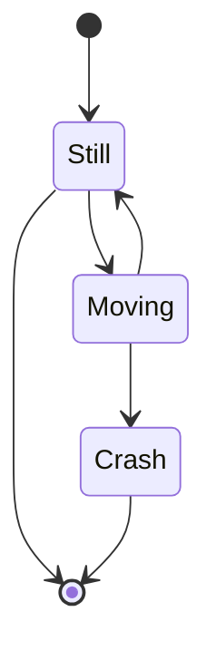

”现有的状态(state) + 输入参数 => 新的状态 + 输出参数“ 这个过程就叫 State Machine。这种过程可以通过 UML 等图描绘出来，如：

## Reference

- [What is a state machine?](https://www.itemis.com/en/yakindu/state-machine/documentation/user-guide/overview_what_are_state_machines#:~:text=A state machine is a,state transitions and produces outputs.)
- https://en.wikipedia.org/wiki/Finite-state_machine

