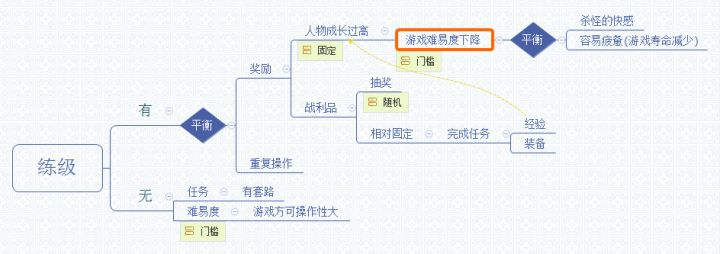

游戏里经常出现<刷经验><练级>这类型功能, 有时候, 我觉得这种功能, 其实是破坏了游戏的娱乐性, 但是有时候觉得又不至于如此.

原由: 最近玩了下<天使帝国4><火焰纹章>.

首先, 为什么有<练级>, 不深究人为设置<等级>这个概念, 大概是因为人喜欢将无形之物化为有形. 而练级, 就有点像人在挣钱. 具有两个性质, 一, 重复. 二, 具有奖励. 练级会不会降低游戏的娱乐性, 简而言之, 就是找这两个概念的平衡.

上图可知, 我认为, <练级>这种存在, 主要为了降低门槛, 然而门槛降低到什么程度, 也就是 **<游戏难易度要多高>**的问题, 这是一个需要寻找平衡的过程.

具体到战棋游戏, 现在我想到解决的方案.

1.据电脑的战棋等级而设置 玩家的战棋 的等级上限. (这个可参照FF14的低级剧本玩法)

(日后想到再更新~~)